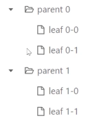
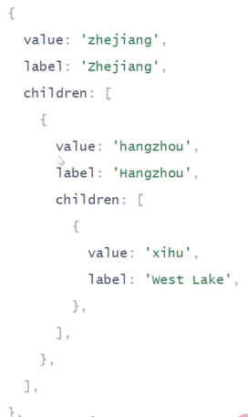
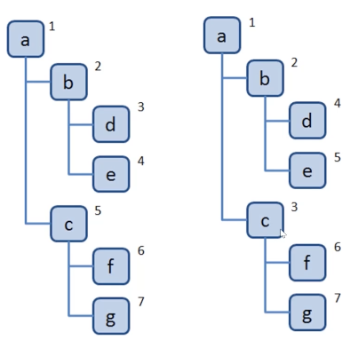
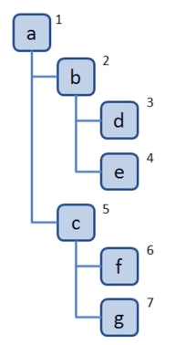
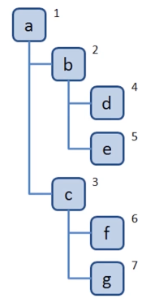
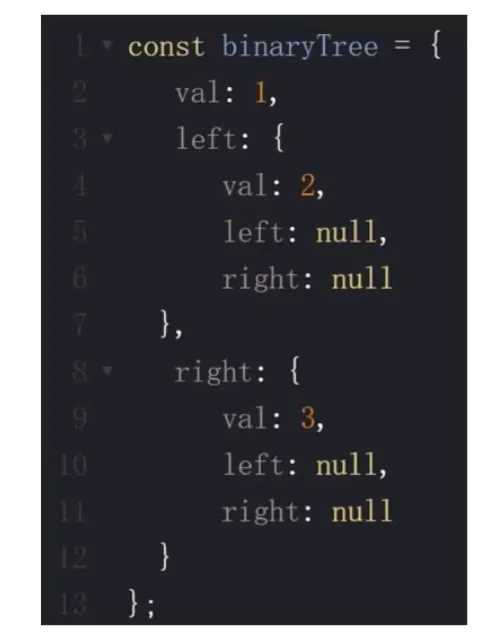
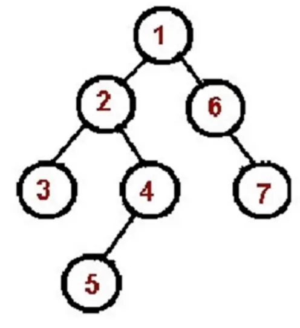
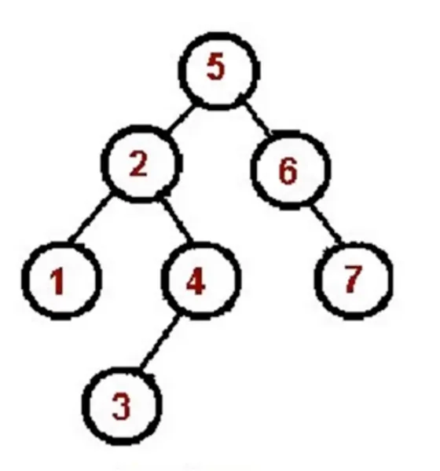
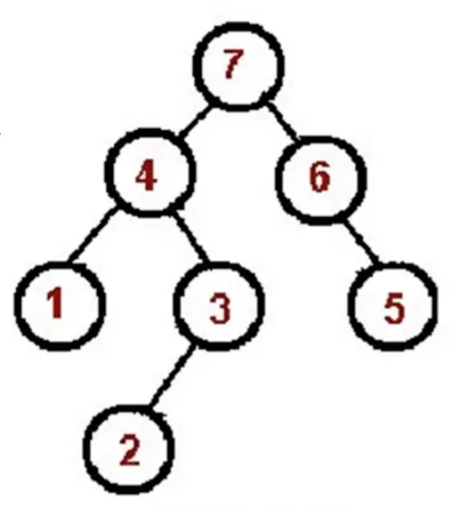
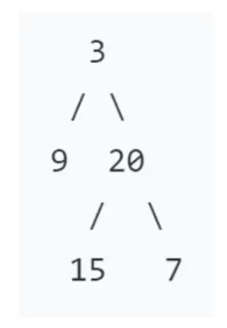

# 8. 数据结构之“树”
## 8-1. 树简介
**树是什么？**
+ 一种分层数据的抽象模型
+ 前端工作中常见的树包括：DOM树、级联选择、树形控件......
+ JS 中没有树，但是可以用 Object 和 Array 构建树。
+ 树的常用操作：深度/广度优先遍历、先中后序遍历。





## 8-2. 深度与广度优先遍历
### 8-2-1. 什么是深度/广度优先遍历？
+ 深度优先遍历：尽可能深的搜索树的分支。
+ 广度优先遍历：先访问离根节点最近的节点。



### 8-2-2. 深度优先遍历算法口诀
+ 访问根节点。
+ 对根节点的 children 挨个进行深度优先遍历。



**Coding Part**
dfs.js
```
const tree = {
  val: a,
  children: [
    {
      val: 'b',
      children: [
        {
          val: 'd',
          children: [],
        }, {
          val: 'e',
          children: [],
        }
      ]
    }, {
      val: 'c',
      children: [
        {
          val: 'f',
          children: [],
        }, {
          val: 'g',
          children: []
        }
      ]
    }
  ]
};

const dfs = (root) => {
  console.log(root.val);
  root.children.forEach(dfs);
};

dfs(tree);
```

### 8-2-2. 广度优先遍历算法口诀
+ 新建一个队列，把根节点入队。
+ 把队头出队并访问。
+ 把队头的 children 挨个入队。
+ 重复第二、三步，直到队列为空。



**Coding Part**
```
const bfs = () => {
  const q = [root];
  while (q.length > 0) {
    const n = q.shift();
    console.log(n.val);
    n.children.forEach(child => {
      q.push(child);
    });
  }
};

bfs(tree);
```
## 8-3. 二叉树的先中后序遍历
### 8-3-1. 二叉树是什么？
+ 树种每个节点最多只能有两个字节点
+ 在 JS 中通常用 Object 来模拟二叉树



### 8-3-2. 先序遍历算法口诀
+ 访问根节点
+ 对根节点的左子树进行先序遍历
+ 对根节点的右子树进行先序遍历



**Coding part**
```
const bt = {
  val: 1,
  left: {
    val: 2,
    left: {
      val: 4,
      left: null,
      right: null,
    },
    right: {
      val: 5,
      left: null,
      right: null,
    }
  },
  right: {
    val: 3,
    left: {
      val: 6,
      left: null,
      right: null,
    },
    right: {
      val: 7,
      left: null,
      right: null,
    }
  }
};

const preorder = (root) => {
  if (!root) return;
  console.log(root.val);
  preorder(root.left);
  preorder(root.right);
};
preorder(bt);
```

### 8-3-3. 中序遍历算法口诀
+ 对根节点的左子树进行中序遍历
+ 访问根节点
+ 对根节点的右子树进行中序遍历



**Coding Part**
```
const inorder = (root) => {
  if (!root) return;
  inorder(root.left);
  console.log(root.val);
  inorder(root.right);
}
inorder(bt)
```

### 8-3-4. 后序遍历算法口诀
+ 对根节点的左子树进行后序遍历
+ 对根节点的右子树进行后序遍历
+ 访问根节点



**Coding Part**
```
const postorder = (root) => {
  if (!root) return;
  postorder(root.left);
  postorder(root.right);
  console.log(root.val);
}
postorder(bt);
```

## 8-4. 二叉树的先中后序遍历（非递归版）
**Coding Part**
```
const preorder = (root) => {
  if (!root) return;
  const stack = [];
  stack.push(root);
  while(stack.length) {
    const n = stack.pop();
    console.log(n.val);
    if(n.right) stack.push(n.right);
    if(n.left) stack.push(n.left);
  }
};

const inorder = (root) => {
  if (!root) return;
  const stack = [];
  let p = root;
  while (stack.length || p) {
    while (p) {
      stack.push(p);
      p.left;
    }
    const n = stack.pop();
    console.log(n.val);
    p = n.right;
  }
}

const postorder = (root) => {
  if (!root) return;
  const outputStack = [];
  const stack = [root];
  while (stack.length) {
    const n = stack.pop();
    outputStack.push(n);
    if (n.left) stack.push(n.left);
    if (n.right) stack.push(n.right);
  }
  while (outputStack.length) {
    const n = outputStack.pop();
    console.log(n.val);
  }
}
```

## 8-5. LeetCode: 104. 二叉树的最大深度
**解题思路**

+ 求最大深度，考虑使用深度优先遍历
+ 在深度优先遍历过程中，记录每个节点所在层级，找出最大的层级即可



**解题步骤**
+ 新建一个变量，记录最大深度
+ 深度优先遍历整棵树，并记录每个节点的层级，同时不断刷新最大深度这个变量
+ 遍历结束返回最大深度这个变量

**Coding Part**
```
var maxDepth = function (root) {
  let res = 0;
  const dfs = (n, l) => {
    if (!n) return;
    consloe.log(n.val, l);
    if (!n.left && !n.right) {
      res = Math.max(res, l);
    }
    dfs(n.left, l+1);
    dfs(n.right, l+1);
  };
  dfs(root, 1);
  return res;
};

//时间复杂度: O(n) n为二叉树的节点数
//空间复杂度: dfs递归调用函数，没调用一次函数，都会生成一个堆栈
//2种情况，1、O(n) 每个子节点只有一个 2、O(logN) 每个子节点有两个
```
## 8-6. LeetCode: 111. 二叉树的最小深度
