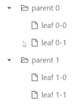
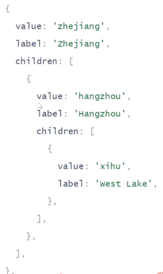
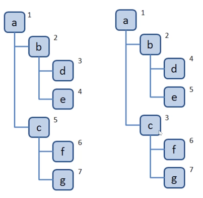
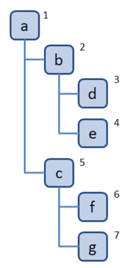
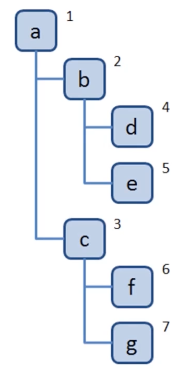

# 8. 数据结构之“树”
## 8-1. 树简介
**树是什么？**
+ 一种分层数据的抽象模型
+ 前端工作中常见的树包括：DOM树、级联选择、树形控件......
+ JS 中没有树，但是可以用 Object 和 Array 构建树。
+ 树的常用操作：深度/广度优先遍历、先中后序遍历。





## 8-2. 深度与广度优先遍历
### 8-2-1. 什么是深度/广度优先遍历？
+ 深度优先遍历：尽可能深的搜索树的分支。
+ 广度优先遍历：先访问离根节点最近的节点。



### 8-2-2. 深度优先遍历算法口诀
+ 访问根节点。
+ 对根节点的 children 挨个进行深度优先遍历。



**Coding Part**
dfs.js
```
const tree = {
  val: a,
  children: [
    {
      val: 'b',
      children: [
        {
          val: 'd',
          children: [],
        }, {
          val: 'e',
          children: [],
        }
      ]
    }, {
      val: 'c',
      children: [
        {
          val: 'f',
          children: [],
        }, {
          val: 'g',
          children: []
        }
      ]
    }
  ]
};

const dfs = (root) => {
  console.log(root.val);
  root.children.forEach(dfs);
};

dfs(tree);
```

### 8-2-2. 广度优先遍历算法口诀
+ 新建一个队列，把根节点入队。
+ 把队头出队并访问。
+ 把队头的 children 挨个入队。
+ 重复第二、三步，直到队列为空。



**Coding Part**
```
const bfs = () => {
  const q = [root];
  while (q.length > 0) {
    const n = q.shift();
    console.log(n.val);
    n.children.forEach(child => {
      q.push(child);
    });
  }
};

bfs(tree);
```