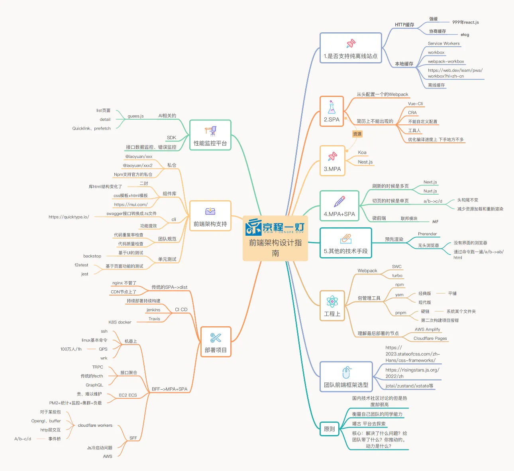
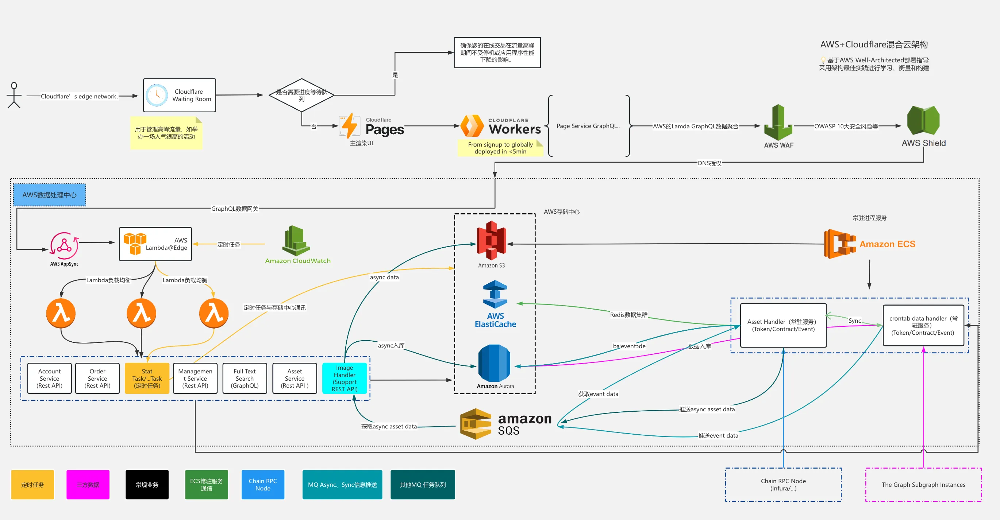
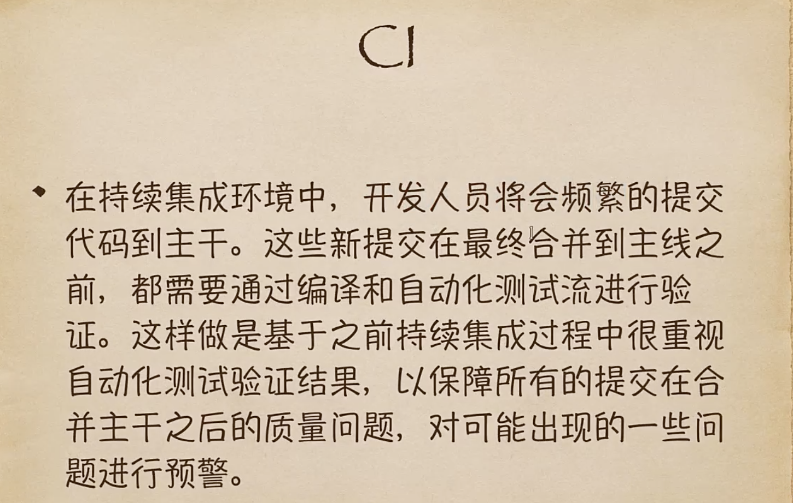
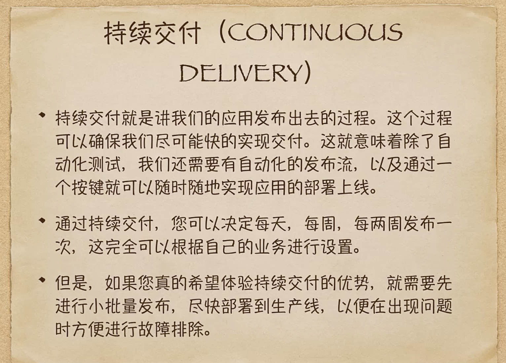
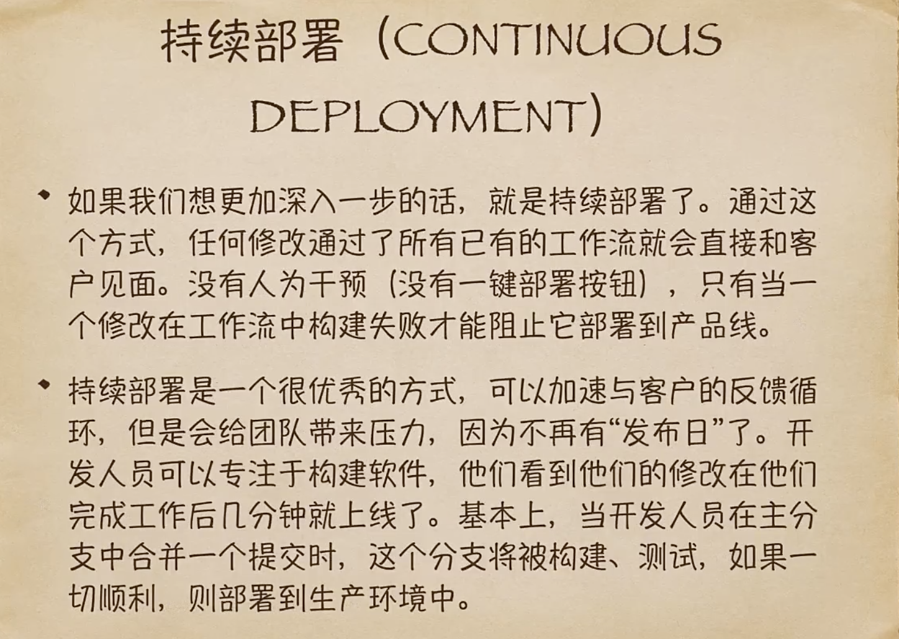
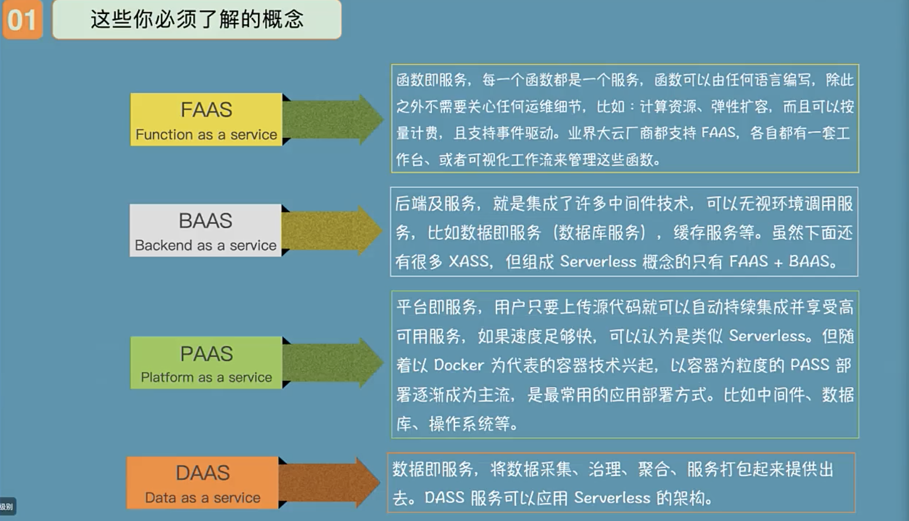
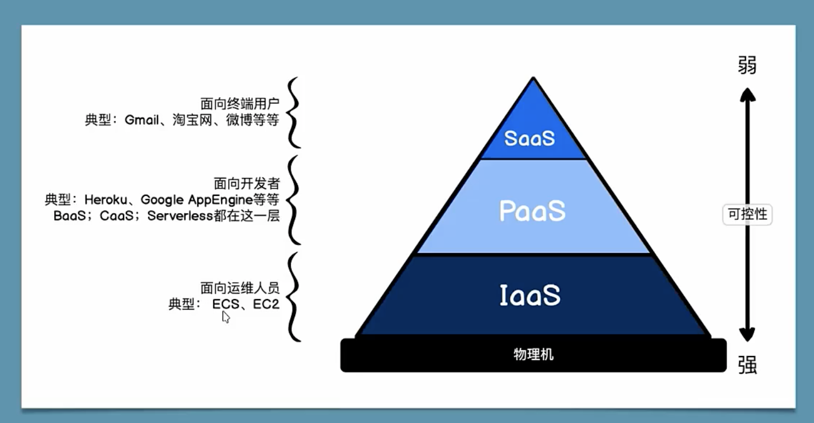
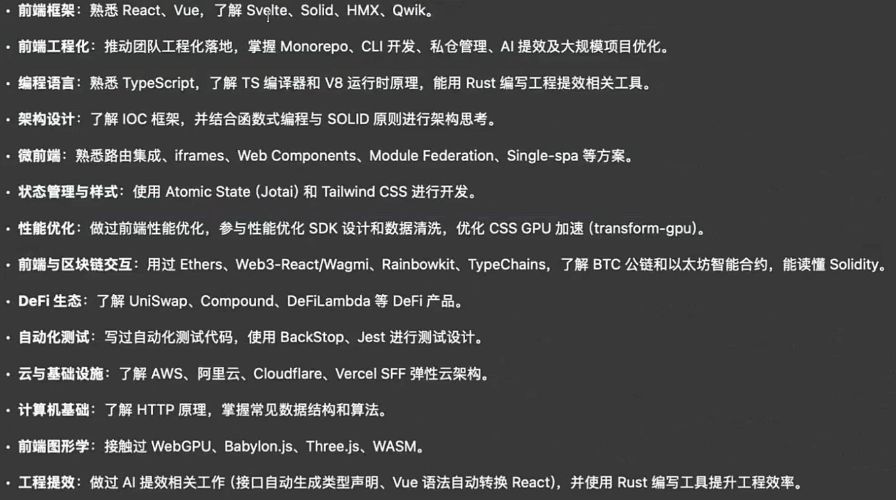

# 前端架构设计指南1-2



# 前端架构
1. 前端架构设计
2. node.js 原理、性能、错误
    Next.js Nest.js React.js TypeScript WebPack Jest
3. 部署 云相关    

## 部署Cloudflare
1. 购买一个域名 部署cloudflare上「可以部署一个Cloudflare Waiting Room 服务，这是第一步的云服务，
  在部署高可用的弹性集群设计的时候，在第一层部署了Cloudflare Waiting Room服务」
2. pages CI CD「面试会考CI CD」
  代码提交后CI会干预：1.代码的lint，对代码进行校验，如jenks；
  CI会hook git的提交记录，一旦项目发生变化，CI机器就会收到变化的新项目，一旦得到了变化，会拉取最新的代码；
  然后对代码进行4件事，
    
    1.对代码lint，如果失败了，打会，不能提交到主干

    2.代码重复率检查, 重复率过高，就打会，如sonarqube
    
    3.CR CodeReviw的流程，分AI的自动CR和传统的人肉「体现你开发过自动话的CR Hook到CI的服务器，Agents」
      传统的人肉浪费成本，还有人有自己的情感因素
    
    4.AI的检测[脱敏、漏洞]通过后，在调用AI去自动的生成auto commit message， 自动的打tagert，merge

  4步都通过后，再去CD「持续交付or持续部署」
    持续交付：就是QA拿到你的代码后，进行测试，对你的代码进行部署，最终上线前QA发行上线流程
    持续部署：比较牛逼不需要人工，提交代码都了git，有个CD机器，CD hook到了代码的变化，直接执行了1，2，3，4；走完后，把代码提交了CD，CD直接跑你的tests，自动化测试，如果通过了，自己部署上线；tests单元测试很重要，必须会
  
  使用过AI开发过自动话的CR和使用AI开发过对应的agents，完成了公司的自动化的单元测试的编写
  
  单元测试jekns

  CI和CD结合就是devops「运维干的活，很多公司卖devops的产品，像华为、微软」cloudflare自动集成了这个事





+ 练一练：
1. 购买一个域名 部署cloudflare上
2. Pages CI CD react单页面应用
  github项目链接+域名链接
3. Workers + 前端连接上 openAI
export default {
  async fetch(request, env, ctx) {
    //openai代理
  },
};

nest.js 适配服务 httpserver

WAF-DDos

Shiled-XSS、CSRF


请求数据4种形式：
  1. fetch「restful /a/b/c」
    {
      a,
      b,
      c
    }
  2. graphQL「自己定义一个schema，想要什么自己取，后端也要支持，常见的appllo graphql 阿波罗」
  type Project {
    name: String
    tagline: String
  }

  3. trpc ts结构 

# 基于ServerLess的架构设计
<!-- 1. 前端开发架构演进之路
2. 何为前端云端化开发
3. 基于ServerLess的架构设计
4. IDE集成CI完成前后云化设计 -->




# 10W个列表解决性能问题面试问题：
1. 常规的虚拟列表

2. 更牛逼的，不在使用DOM把整个页面装进canvas，这样整个性能会上升千倍万倍，因为使用了canvas 绘制了整个DOM，页面一个DOM都没有，所有东西都是canvas绘制出来的

3. 还有js多线程方式，做一个DOM快照的映射，然后把这个映射，js把这个指针的传递buffer vue，js传递内存的指针给webworker，然后把这个映射的DOM的指针传递过去后，在worker中对这个复杂的url进行处理，处理后，在用指针指回来，然后在真实的DOM中在继续改

# 前端架构选型
设计一个前端架构时，先不管任务框架

+ 优先考虑站点是否完全离线，还是离线一部分
  + 完全离线最需要掌握的，Application下的 Service workers
  + 还有PWA、AMP「面试常考」
    AMP 是让DOM增强，渲染高性能的DOM「国内很少用」
    PWA 是把H5应用变成native App「因为传统的APP性能高，那么是否可以直接使用nativeAPP和外部app融合呢」，可以把H5的网页的资源全都放到本地；「因为后面有许多问题，黑边，白边啥都，后面就没啥人用了，但是留下了一个技术Service workers，Service workers可以把整个站点完全离线」
  + Service workers面临的大挑战，就是说离线会造成一个很大问题，如果资源更新没有很明白，那么用户就看不到信息了「那么有几种方式处理： 1、手写Service workers 2、workbox 3、workbox-webpack-plugin」
  + 最难控制的是默认缓存，所以只能sw控制版本
  + 乐观更新：不管有没联网都能交互「比如：网络断了，微信点赞，后续才会提示你网络有问题，没有点上」

如果使用了workbox那么就整站缓存；

怎么开启强缓存和协商缓存？「面试」
如果离线缓存太激进了，可以使用
+ 强缓存和协商缓存+离线缓存

```
localstorage
大小5M

index.html 不加载任何的js

一段代码 + json文件
{
  页面的全部静态资源
  index.js: "/scripts/index45466-rty.js"
}

if (localStorage["index.js"]) {
  if(localStorage["index.js"] == "/scripts/index45466-rty.js") {
    addScript(localStorate[""/scripts/index45466-rty.js""])
  }else {
    删除localStorage[""/scripts/index45466-rty.js""]
    localStorage["index.js"] = json("index.js")
    const result = fetch(json("index.js"));
    localStorage[json("index.js")] = result
  }
}else {
  localStorage["index.js"] = json("index.js")
  const result = fetch(json("index.js"));
  localStorage[json("index.js")] = result
}

判断 本地存不存在缓存
    存在 过期没
    过期了 更新一下本地的缓存
fetch 在次把缓存记录下来

localStorage 以前同步读取更快，现在是异步读取会更快
```

+ 前端架构四种选择
1. SPA
2. MPA
3. MPA + SPA「两种模式」
  3-1. MPA套SPA「两套模版：
                  1、常见的同构化，next.js
                  2、 常规的koa+vue」
  3-2. 
4. 预渲染「大厂喜欢的用」

+ 选JS方案 https://risingstars.js.org/2024/zh

+ 选CSS方案 https://2024.stateofcss.com/zh-Hans/css-frameworks/


- **前端框架**：熟悉 React、Vue，了解 Svelte、Solid、HMX、Qwik。
- **前端工程化**：推动工程化落地，掌握 Monorepo、CLI、Biome统一开发规范与私仓管理、Affine管理团队WIKI。
- **编程语言**：熟悉 TypeScript，理解 TS 编译器与 V8 原理，能用 AssemblyScript、Rust 开发Webpack插件与Loader。
- **架构设计**：了解 IOC 框架，结合函数式编程与 SOLID 原则，熟悉 SPA/MPA 及同构方案。
- **微前端**：掌握路由集成、iframes、Web Components、Module Federation、Single-spa。
- **状态管理与样式**：基于 Atomic 理念，使用 Jotai 与 Tailwind CSS 高效开发。
- **性能优化**：参与前端性能优化，设计优化 SDK，并应用 CSS GPU 加速（transform-gpu）。
- **Web3 行业经验**：使用 Ethers、Wagmi、Rainbowkit、TypeChains，能读懂 Solidity。
- **DeFi 生态**：了解 UniSwap、Compound、DeFiLambda 等主流 DeFi 协议与应用。
- **自动化测试**：利用 AI 编写测试代码，熟练使用 BackStop、Jest 进行自动化测试。
- **云与基础设施**：熟悉 AWS、阿里云、Cloudflare、Vercel 等弹性云架构。
- **计算机基础**：理解 HTTP 原理，掌握常见数据结构与算法。
- **前端图形学**：了解 WebGPU、Babylon.js、Three.js、WASM 、Phaser.js、CoCos等前端图形技术。
- **工程提效**：实践 AI 提效，如自动生成类型、Vue 转 React、AI CodeReview、D2C。
- **AI 相关**：熟悉 A2A/MCP/Agents 开发，掌握 N8N、Flowise、RAG 及本地 LLM 部署。