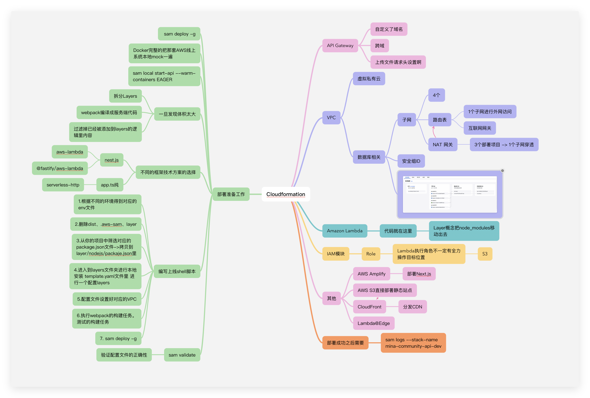

# 前端架构设计指南10


CloudFfront -> api-getway -> Lambda -> VPC主网（数据库在一起）-> 子网 -> (4个子网) -> (3个子网对内 1个子网对外 出来的)

外部访问 -> <- 程序 <-> github <-

SAM 配置文件

适配SAM

npm install -g sam

全局配置sam权限，把密钥配置到 cat ～/.aws/credentials 这样就不用每次deloy时,都不用输入密钥了

初始化配置时，会得到一个 template.yaml 文件

新建layer/nodejs


sam deploy => 代码部署到CloudFormation

作业：
熟悉 aws sam，用sam部署一个hello

4000-5000
SPA
next
工程化
性能优化
合约交互

八股文AI 算法 原理掌握

## 什么是子网？
子网（Subnet）是计算机网络中的一个重要概念，指的是将一个大的网络划分成多个较小的网络段。

### 基本概念
子网 是通过子网掩码将一个网络地址空间划分成多个逻辑上独立的网络段，每个子网都有自己的网络地址范围。

### 为什么需要子网划分

1. 提高网络效率
+ 减少广播域的大小
+ 降低网络拥塞
+ 提高数据传输效率

2. 增强安全性
+ 隔离不同部门或功能的网络
+ 便于实施访问控制策略
+ 减少安全威胁的传播范围

3. 便于管理
+ 简化网络管理和故障排除
+ 便于实施不同的网络策略
+ 更好的资源分配

4. 节约IP地址
+ 避免IP地址浪费
+ 更有效地利用地址空间

### 子网划分原理
IP地址结构

IP地址 = 网络部分 + 主机部分

### 子网掩码
子网掩码用来确定IP地址中哪些位是网络部分，哪些位是主机部分。
常见子网掩码：

+ /24 或 255.255.255.0 - 可容纳254个主机
+ /25 或 255.255.255.128 - 可容纳126个主机
+ /26 或 255.255.255.192 - 可容纳62个主机
+ /27 或 255.255.255.224 - 可容纳30个主机

### 实际例子
例子1：公司网络划分

假设公司有 192.168.1.0/24 这个网络：
```
原始网络：192.168.1.0/24 (192.168.1.1 - 192.168.1.254)

划分为4个子网：
- 子网1：192.168.1.0/26   (192.168.1.1 - 192.168.1.62)    - 销售部
- 子网2：192.168.1.64/26  (192.168.1.65 - 192.168.1.126)  - 技术部  
- 子网3：192.168.1.128/26 (192.168.1.129 - 192.168.1.190) - 财务部
- 子网4：192.168.1.192/26 (192.168.1.193 - 192.168.1.254) - 管理层
```

例子2：家庭网络
```
路由器分配：192.168.0.0/24
- 有线设备：192.168.0.1 - 192.168.0.100
- 无线设备：192.168.0.101 - 192.168.0.200  
- 访客网络：192.168.0.201 - 192.168.0.254
```

### 子网划分步骤
1. 确定需求
+ 需要多少个子网？
+ 每个子网需要多少主机？

2. 选择合适的子网掩码
+ 需要的子网数 ≤ 2^借用位数
+ 每个子网的主机数 ≤ 2^主机位数 - 2

3. 计算子网地址
+ 使用二进制计算或子网划分工具

### 常见子网类型
1. 固定长度子网掩码（FLSM）
+ 所有子网使用相同的子网掩码
2. 变长子网掩码（VLSM）
+ 不同子网可以使用不同长度的子网掩码，更灵活高效

### 子网划分工具
在线计算器

+ 子网计算器网站
+ IP地址规划工具

命令行工具
```
bash# Linux/Mac 查看网络配置
ifconfig
ip addr show

# Windows 查看网络配置  
ipconfig /all
```

### 实际应用场景
1. 企业网络
+ 按部门划分子网
+ 服务器子网与用户子网分离
+ DMZ子网用于公共服务

2. 数据中心
+ Web服务器子网
+ 数据库服务器子网
+ 管理网络子网

3. 云计算
+ 公有子网（可访问互联网）
+ 私有子网（内部通信）
+ 跨可用区子网设计

子网划分是网络设计的基础，合理的子网规划可以显著提高网络的性能、安全性和可管理性。