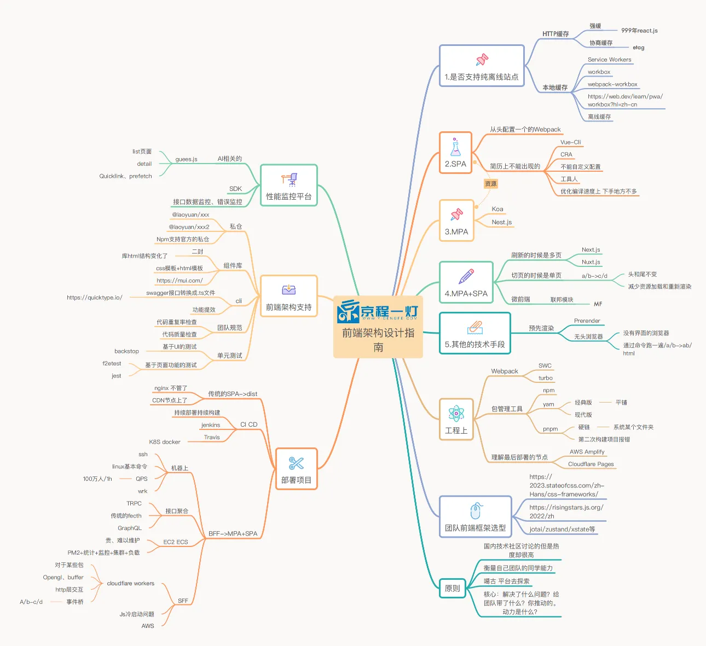

# 前端架构设计指南1-2



# 前端架构选型
设计一个前端架构时，先不管任务框架

+ 优先考虑站点是否完全离线，还是离线一部分
  + 完全离线最需要掌握的，Application下的 Service workers
  + 还有PWA、AMP「面试常考」
    AMP 是让DOM增强，渲染高性能的DOM「国内很少用」
    PWA 是把H5应用变成native App「因为传统的APP性能高，那么是否可以直接使用nativeAPP和外部app融合呢」，可以把H5的网页的资源全都放到本地；「因为后面有许多问题，黑边，白边啥都，后面就没啥人用了，但是留下了一个技术Service workers，Service workers可以把整个站点完全离线」
  + Service workers面临的大挑战，就是说离线会造成一个很大问题，如果资源更新没有很明白，那么用户就看不到信息了「那么有几种方式处理： 1、手写Service workers 2、workbox 3、workbox-webpack-plugin」
  + 最难控制的是默认缓存，所以只能sw控制版本
  + 乐观更新：不管有没联网都能交互「比如：网络断了，微信点赞，后续才会提示你网络有问题，没有点上」

如果使用了workbox那么就整站缓存；

怎么开启强缓存和协商缓存？「面试」
如果离线缓存太激进了，可以使用
+ 强缓存和协商缓存+离线缓存

```
localstorage
大小5M

index.html 不加载任何的js

一段代码 + json文件
{
  页面的全部静态资源
  index.js: "/scripts/index45466-rty.js"
}

if (localStorage["index.js"]) {
  if(localStorage["index.js"] == "/scripts/index45466-rty.js") {
    addScript(localStorate[""/scripts/index45466-rty.js""])
  }else {
    删除localStorage[""/scripts/index45466-rty.js""]
    localStorage["index.js"] = json("index.js")
    const result = fetch(json("index.js"));
    localStorage[json("index.js")] = result
  }
}else {
  localStorage["index.js"] = json("index.js")
  const result = fetch(json("index.js"));
  localStorage[json("index.js")] = result
}

判断 本地存不存在缓存
    存在 过期没
    过期了 更新一下本地的缓存
fetch 在次把缓存记录下来

localStorage 以前同步读取更快，现在是异步读取会更快
```

+ 前端架构四种选择
1. SPA
2. MPA
3. MPA + SPA「两种模式」
  3-1. MPA套SPA「两套模版：
                  1、常见的同构化，next.js
                  2、 常规的koa+vue」
  3-2. 
4. 预渲染「大厂喜欢的用」

+ 选JS方案 https://risingstars.js.org/2024/zh

+ 选CSS方案 https://2024.stateofcss.com/zh-Hans/css-frameworks/

