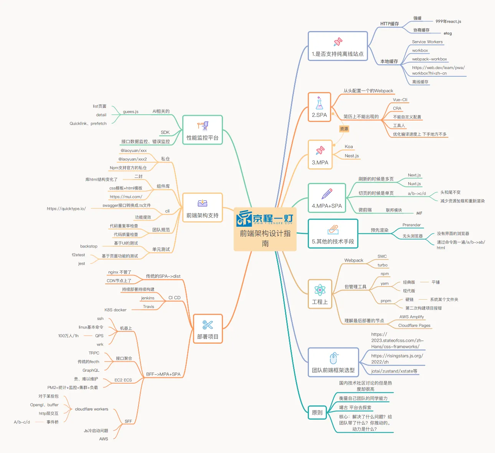
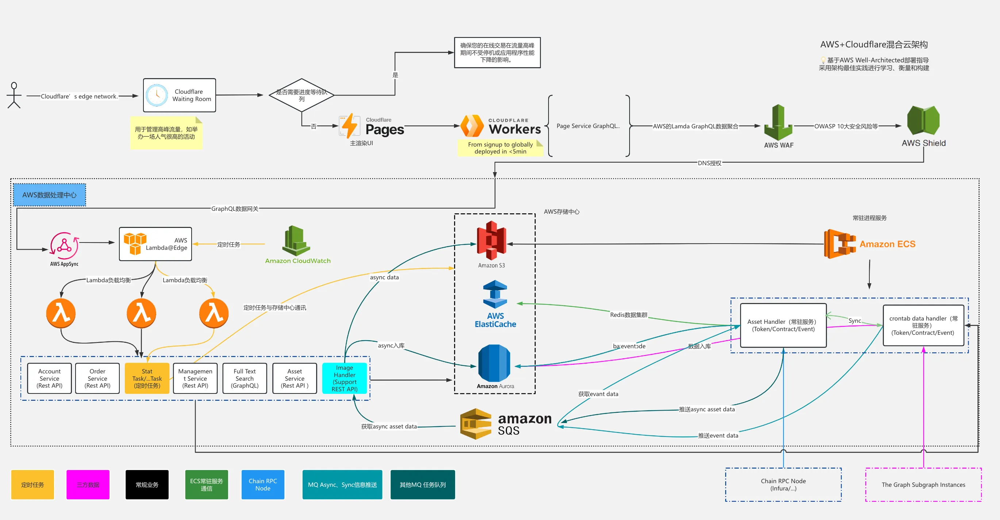

# 前端架构设计指南1



## npm、yarn、pnpm区别
```
$ mkdir YD-AI-DAPP
$ cd yd-ai-dapp
$ npm init -y
```
```
{
  "name": "yd-ai-dapp",
  "version": "1.0.0",  // 后边是小版本更新，中间大变化，第一个巨大的升级
  "main": "index.js",
  "scripts": {
    "test": "echo \"Error: no test specified\" && exit 1"
  },
  "keywords": [],
  "author": "",
  "license": "ISC",
  "description": ""
}
```

npm 现在基本没啥人用了，因为有幽灵依赖

```npm
在一个项目里面a依赖了b，b依赖了c;
d依赖了c
f依赖了b
这样导致安装了很多b和c，导致nodules体积很大

|- a
  |- b
    |- c

|- d
  |- c

|- f
  |- b
```

所以有了yarn，yarn是扁平化
```yarn
a里面依赖了b、依赖c，这里面就形成了软链

软链：相当于快捷方式，改了快捷方式对本地没影响
硬链：改了就会有影响

|- a
|- b
|- c
```

## Linux中硬链接和软链接区别和用法

### 创建测试文件
首页创建一个原始文件
```
# 创建原始文件
echo "这是原始文件内容" > original.text
ls -li original.txt
```

### 硬链接（Hard Link）
硬链接是指向同一个inode的多个文件名：
```
# 创建硬链接
ln original.txt hardlink.txt

# 查看文件信息
ls -li original.txt hardlink.txt
```
输出示例：
```
123456 -rw-r--r-- 2 user user 21 Jun 8 10:30 hardlink.txt
123456 -rw-r--r-- 2 user user 21 Jun 8 10:30 origin.txt
```
注意：
+ 两个文件的inode号相同（123456）
+ 链接计数为2（第三列）
+ 文件大小相同

### 软链接（Symbolic Link）
软链接是指向另一个文件路径的符号链接：
```
# 创建软链接
ln -s original.txt softlink.txt

# 查看文件信息
ls -li original.txt softlink.txt
```

输出示例：
```
123456 -rw-r--r 2 user user 21 Jun 8:10:30 original.txt
789012 lrwxrwxrwx 1 user user 12 Jun 8:10:31 softlink.txt -> original.txt
```

注意：
+ 软链接有不同的inode号（789012）
+ 文件类型为l（链接）
+ 显示指向目标文件的箭头

### 测试链接行为
**修改内容测试**
```
# 通过硬链接修改内容
echo "通过硬链接修改" >> hardlink.txt

# 查看所有文件内容
cat original.txt
cat hardlink.txt
cat softlink.txt
```
所有文件都会改变，应为硬链接和软链接都指向同一个数据

**删除原文件测试**
```
# 删除原文件
rm original.txt

# 查看链接状态
ls -li hardlink.txt softlink.txt
cat hardlink.txt	# 仍然可以访问
cat softlink.txt	# 会报错：No such file or directory
```

**主要区别总结**

| 特征 | 硬链接 | 软链接 |
|-----|-----|-----|
| inode | 相同 | 不同 |
| 跨文件系统 | 不可以 | 可以 |
| 指向目录 | 不可以 | 可以 |
| 原文件删除后 | 仍可访问 | 失败 |
| 占用空间 | 不额外占用 | 占用少量空间 |


**实际应用场景**
硬链接适用于：
+ 备份重要文件（节省空间）
+ 在不同位置访问同一文件

软链接适用于：
+ 创建快捷方式
+ 链接到其他文件系统的文件
+ 链接目录
这就是Linux硬链接和软链接的基本用法和区别

### inode在硬链和软链中的区别
硬链：inode内有个数据块，硬链中通过inode来共享资源，也就是说指向这个inode的数据块，删除只是删了和inode的链接，所以占用空间更小

软链：是新建一个inode，删除也是直接删除一整个inode，所以占用空间更大

### yarn 和 pnpm 的区别，在硬链和软链的空间节省上
yarn 和 pnpm 都是 Node.js 包管理器，但它们在依赖管理和存储机制上有显著区别，特别在硬链接和软链接的使用上：

**核心存储机制差异**
yarn(v1):
+ 使用传统的 node_nodules 偏平化结构
+ 每个项目都会完整复制所有依赖包
+ 不能使用链接机制，占用大量磁盘空间

pnpm：
+ 使用创新的内容寻址存储(CAS) + 链接机制
+ 全局之存储一份包文件，所有项目通过链接共享

### 链接机制详解
**pnpm 的双重链接策略**
1. 硬链接（Hard Links）：
	+ 连接全局存储项目 .pnpm 目录
	+ 指向同一个 inode，不占用额外空间
	+ 文件内容完全共享
2. 软链接（Symbolic Links）：
	+ 从 node_modules 指向 .pnpm 目录
	+ 维护正确的依赖关系结构
	+ 解决依赖嵌套问题

### 具体工作流程
```
目录目录/
|- node_modules/
|	|- package-a -> .pnpm/package-a@1.0.0.0/node_modules/package-a (软链接)
|	|- package-b -> .pnpm/package-b@2.0.0.0/node_modules/package-b (软链接)
|—— .pnpm/
	|- package-a@1.0.0/node_modules/package-a (硬链接到全局存储)
	|- package-b@2.0.0/node_modules/package-2 (硬链接到全局存储)
```
### 空间节省对比
**传统方式（yarn v1）**
+ 项目A：loadsh (1MB)
+ 项目B：loadsh (1MB)
+ 项目C：loadsh (1MB)
+ 总占用：3MB

**pnpm 方式**
+ 全局存储：lodash（1MB，硬链接）
+ 项目A：软链接（几乎不占空间）
+ 项目B：软链接（几乎不占空间）
+ 项目C：软链接（几乎不占空间）
+ 总占用：约1MB

### yarn v2 +（Berry）的改进
yarn 现代版本引入了 PnP（Plug'n'Play）模式：
+ 不实用 node_modules
+ 通过 .pnp.cjs 文件管理依赖映射
+ 也能显著节省空间，当兼容性略差

### 实际节省效果
根据使用场景，pnpm 通常能节省
+ 50-80% 的磁盘空间
+ 更快的安装速度（因为大部分文件已存在）
+ 更好的一致性（同一包版本全局唯一）
pnpm 的链接机制是其最大优势，既保证了 Node.js 模块解析的兼容性，又实现了最大程度的空间节省

### 三者新老区别
1. 老的npm
node_modules
	A
		node_modules (B)
			F.js
			node_modules (C)
			F+v2.js
	
	新的npm，F的版本不一致，提出一个F，剩下的还留在里面，第一安装的版本提出来
	A
	B
	C
	F.js

2.yarn
	v1后半期  1.22.22「经典版 severless使用」
	v2 (常用 软链)
	.Pnp 模式「没有node_modules, 火过一段时间，后来没用了，兼容性做得不好」 全局目录 .pnp.cjs
	V3（pnpm硬链）

3.pnpm
	硬链接（Hard Links）
+ 连接全局存储到项目的 .pnpm 目录 「因为severless 不允许访问全局目录，所以不用pnpm管理项目」
+ 指向同一个inode，不占用额外空间
+ 文件内容完全共享

### yarn 和 pnpm 是怎么解决幽灵依赖的「面试常用」
面试三个问题：
1. npm、yarn、pnpm 项目中选择哪个
2. yarn 和 pnpm 是怎么解决幽灵依赖
3. npm、yarn、pnpm 是怎么解决循环依赖

**yarn的解决方案**
Yarn 1.x时期：使用扁平化安装，实际上会产生幽灵依赖问题
yarn 2+（Berry）：引入了Plug'n'Play（PnP）机制：
+ 不再创建 node_modules 文件夹「没有node_modules就不再有幽灵依赖问题」
+ 生成 .pnp.cjs 文件记录依赖关系映射
+ 运行时通过PnP resolver 精确控制模块解析
+ 只能访问package.json 中明确声明的依赖，彻底杜绝幽灵依赖

```
// .pnp.cjs 会精确记录每个包能访问哪些依赖
["my-package", {
	["npm:1.0.0"], {
		"packageLocation": "./yarn/cache/...",
		"packageDependencies": [
			["lodash", "npm:4.17.21"]
		]
	}
}]
```
**pnpm的解决方案**
采用符号链接+内容寻址存储的策略：
1. 非扁平化的node_modules结构：
```
node_modules/
|- .pnpm/
|	|- lodash@4.17.21/
|	|_ express@4.18.0/
|_ express/ -> .pnpm/express@4.18.0/node_modules/express
```

2. 严格的依赖隔离：
+ 每个包只能看到自己package.json 中声明的依赖
+ 通过符号链接精确控制依赖可见性
+ 未神明的依赖无法被访问

3. 全局存储：
+ 所有版本的包存储在全局pnpm-store中
+ 通过硬链接共享相同文件，节省磁盘空间

**对比总结**
| 方案 | yarn PnP | pnpm |
|-----|-----|-----|
| 实现方式 | 自定义模块解析器 | 符号链接+硬链接 |
| 兼容性| 需要工具支持PnP | 与现有工具兼容性好 |
| 性能 | 安装快，无node_modules | 安装快，共享存储 |
| 严格性 | 完全杜绝幽灵依赖 | 严格控制依赖访问 |

两种方案都能有效解决幽灵依赖，但pnpm 因为更好的生态兼容性而被广泛采用

### npm、yarn、pnpm 如何解决循环依赖
循环依赖是包管理器中常见的问题，以下是 npm、yarn和pnpm的解决方案

**检测循环依赖**
npm：
```
npm ls --depth=0
npm audit
# 或使用第三方工具
npx nadge --circular --extensions js,ts ./src
```

yarn:
```
yarn list --depth=0
yarn audit
# yarn v2+ 有内置检测
yarn dlx madge --circular --extensions js,ts ./src
```

pnpm:
```
pnpm list --depth=0
pnpm audit
# pnpm 对循环依赖检测更严格
```

**解决方案**
1. 重构代码结构
```
// 问题：A.js 和 B.js 相互依赖
// A.js
import B from './B.js'
export default class A {
	useB() { return new B() }
}

// B.js
import A from './A.js'
export default class B {
	useA() { return new A() }
}

// 解决：提取共同依赖到第三个模块
// common.js
export const shared = { /* 共同逻辑 */}

// A.js
import { shared } from './common.js'
export default class A { /* 使用 shared */ } 

// B.js
import { shared } from './common.js'
export default class B { /* 使用 shared */ } 
```

2. 使用动态导入
```
// 延迟加载打破循环
export default class A {
	async useB() {
		const { default: B } = await import('./B.js')
		return new B()
	}
}
```

3. 依赖注入
```
// 通过参数传递依赖而非导入
export default class A {
	constructor(bInstance) {
		this.b = bInstance
	}
}
```

### 包管理器特定解决方案
**npm 解决方案**
```
# 清理缓存
npm class clean --froce

# 删除 node_modules 重装
rm -rf node_modules package-lock.json
npm install

# 使用 --legacy-peer-deps 处理对待依赖冲突
npm install --legacy-peer-deps
```

**yarn 解决方案**
```
# 清理缓存
yarn cache clean

# 重装依赖
rm -rf node_modules yarn.lock
yarn install

# yarn v2+ 使用 resolutions 强制版本
# package.json
{
	"resolutions": {
		"package-name": "version"
	}
}
```

**pnpm 解决方案**
```
# pnpm 的 node_modules 结构天然避免很多循环依赖
pnpm store prune
rm -rf node_modules pnpm-lock.yaml
pnpm install

# 使用 overrids 强制版本
# package.json
{
	"pnpm": {
		"overrides": {
			"package-name": "version"
		}
	}
}
```

### 预防措施
1. 使用 ESLint 规则：
```
// .eslintrc.js
module.exports = {
	rules: {
		'import/no-cycle': 'error'
	}
}
```

2. 设置严格的项目结构
```
src/
	utils/				# 工具函数，不依赖业务模块
	components/		# 组件层
	services/ 		# 服务层
	stores/				# 状态管理
```

3. 使用 TypeScript 的严格模式可以在编译时发现一些循环依赖问题
pnpm 优势：pnpm 的硬链接和符号链接机制使其在处理依赖关系时更加严格，能够更早发现循环依赖问题，推荐在新项目中使用

如果遇到 node_modules 中本身存在循环依赖呢？
本身就有问题，没有太好的解决方法

死循环了怎么处理：写代码时添加eslint，需要三方包问题的话，也不建议去处理，使用pnpm本身就会报错
实在要处理，有个三种包管理通用的机制，就把我们需要的包单独提取出来，起个别名使用
创建自定义的依赖解析
```
// webpack.config.js
module.exports = {
	resolve: {
		alias: {
			'problematic-package': require.resolve('alternative-package')
		}
	}
}
```

解决第三方包循环依赖
1. 版本升级/降级
```
# 升级到最新版本（通常会修复循环依赖）
npm update package-name
yarn upgrade package-name
pnpm update package-name

# 或者降级到限定版本
npm install package-name@1.2.3
```

2. 使用 resolutions/overrides 强制版本统一
npm（package.json）
```
{
	"overrides": {
		"problematic-pageage": "2.1.0",
		"nested-package": {
			"problematic-package": "2.1.0"
		}
	}
}
```

yarn (package.json)
```
{
	"resolutions": {
		"problematic-pageage": "2.1.0",
		"**/problematic-package": "2.1.0"
	}
}
```

pnpm (package.json)
```
{
	"pnpm": {
		"overrides": {
			"problematic-package": "2.1.0"
		}
	}
}
```
3. 使用 patch-package 修复第三方包
```
# 安装 patch-package
npm install --save-dev patch-package

# 修改 node_modules 中的问题文件后生成补丁
npx patch-package package-name

# 在 package.json 中添加 postinstall 脚本
{
	"scripts": {
		"postinstall": "patch-package"
	}
}
```

4. 替换有问题的包
```
# 寻找替代包
npm search alternative-package

# 或者使用包的 fork 版本
npm install @someone/fixed-package-name
```

### 3个常见面试题
1. 为什么使用pnpm？
2. 幽灵依赖都是怎么处理的？
3. 循环依赖怎么解决？


### 手写webpack「暂时使用pnpm包管理工具」
构建单页面应用，不能用脚手架，必须要手写webpack

amd cmd commonjs umd esmodules

1.webpack web (commonjs)
2.rollup 	sdk (支持以上的 amd cmd commonjs umd esmodules 所有规范)
3.parcel/vite 快速的构建一个测试环境

### 创建目录结构
```
mkdir YD-AI-DAPP
npm init -y

YD-AI-DAPP
	|-config
	|-docs
	|-public
	|-scripts
		|-dev
			|-dev.sh
		|-pord
	|-src
		|-index.ts
	|-tests
		|-e2e
		|-uint
	|-webpack.config.js
```
```
pnpm i webpack webpack-cli-D

<!-- webpack.config.js -->
const webpackBaseConfig = {};
module.exports = webpackBaseConfig;


<!-- package.json -->

 "scripts": {
    "client:dev": "webpack --mode development",
    "client:server": "webpack serve --mode development",
    "client:prod": "webpack --mode production",
    "test": "echo \"Error: no test specified\" && exit 1"
  },

pnpm run client:dev //报错

<!-- config -->
在config下新建
webpack.development.js
webpack.production.js


<!-- webpack.config.js -->
+ const merge = require('webpack-merge');
+ const argv = require('yargs-parser')(process.argv.slice(2));//解析--mode后面的环境：webpack --mode development
+ console.log('argv', argv);
+ const _mode = argv.mode || 'development';
+ const _mergeConfig = require(`./config/webpack.${_mode}.js`);

const webpackBaseConfig = {};
module.exports = webpackBaseConfig;

//安装yargs-parser -D包
pnpm i yargs-parser -D

pnpm run client:dev

日志打印：
argv: { _: [], mode: 'development' }
```

```
识别index.ts
需要配置loader

<!-- webpack.config.js -->

const { resolve } = require('path');
const merge = require('webpack-merge');
const argv = require('yargs-parser')(process.argv.slice(2));//解析--mode后面的环境：webpack --mode development
console.log('argv', argv);
const _mode = argv.mode || 'development';
const _mergeConfig = require(`./config/webpack.${_mode}.js`);

const webpackBaseConfig = {
+  entry: {
+    main: resolve('src/index.ts'),
+  },
+  output: {
+    path: resolve(process.cwd(), 'dist'),
+  },
+	module: {
+		rules: [
+			{
+				test: /\.(ts|tsx)$/,
+				exclude: /(node_modules)/,
+				use: {
+					// `.swcrc` can be used to configure swc
+					loader: 'swc-loader',
+				},
+			},
+			{
+				test: /\.(eot|woff|woff2|ttf|svg|png|jpg)$/i,
+				type: 'asset/resource',
+			}
+		]
+	}
};
module.exports = merge.defualt(webpackBaseConfig, _mergeConfig)
```
```
//.swcrc
{
	"$schema": "https://json.schemastore.org/swcrc",
  "jsc": {
		"parser": {
			"syntax": "typescript",
			"tsx": true,
			"decorators": true,
			"dynamicImport": true
		},
		"transform": {
			"legacyDecorator": true,
			"decoratorMetadata": true,
			"react": {
				"runtime": "automatic",
				"refresh": true,
				"development": false,
				"pragma": "React.createElement",
				"pragmaFrag": "React.Fragment"
			}
		},
		"target": "es2022",
		"loose": true,
		"externalHelpers": true,
		"keepClassNames": true,
	},
	"module": {
		"type": "es6",
		"strict": true,
		"strictMode": true,
		"lazy": true,
		"noInterop": false
	},
	"minify": true,
	"sourceMaps": true,
	"exclude": ["node_modules", ".git", "dist"]
}
```
```
安装 swc-loader, 到npm.js 搜swc-loader
pnpm i @swc/core swc-loader -D
pnpm run client:dev
以上项目就可以支持ts了
```

支持tsx
```
src下新建
MVC			components
SOLID		abis	connections
函数式	 hooks
IOC			只能在node开发
布局		layouts
页面		pages
路由		routes
类型		types
状态管理	store
工具		utils

index-dev.html	开发环境
index-prod.html	生产环境
index.css
```
第一周脚手架删了，换成该架构

```
pnpm i react react-dom
pnpm i react-router-dom
//支持ts
pnpm i @types/react @types/react-dom -D
//index.tsx
import { reacteRoot } from 'react-dom/client';

import { BrowserRouter } from 'react-router-dom';
import './wdyr';
import './style.css';
const App = () => {
	return (
		<>
			<h1>1111</h1>
		</>
	);
};
const container = document.getElementById('app');
if(!container) {
	throw new Error('Failed to find the root element');
}
const root = createRoot(container);

root.render(
	<BrowserRouter>
		<App />
	</BrowserRouter>
)
```
```
//index-dev.html
<!DOCTYPE html>
<html lang="en">
<head>
    <meta charset="UTF-8">
    <meta name="viewport" content="width=device-width, initial-scale=1.0">
    <title>Document</title>
</head>
<body>
	<div id="app"></div>
</body>
</html>
```

配置tsconfig.json
```
{
  "compilerOptions": {
    "target": "es5",
    "lib": ["dom", "dom.iterable", "esnext"],
    "allowJs": true,
    "skipLibCheck": true,
    "esModuleInterop": true,
    "allowSyntheticDefaultImports": true,
    "strict": true,
    "forceConsistentCasingInFileNames": true,
    "module": "esnext",
    "moduleResolution": "node",
    "resolveJsonModule": true,
    "isolatedModules": true,
    "noEmit": true,
    "jsx": "react-jsx",
    "rootDir": ".",
    "baseUrl": ".",
    "paths": {
      "@/*": ["src/*"],
      "@pages/*": ["src/pages/*"],
      "@hooks/*": ["src/hooks/*"],
      "@utils/*": ["src/utils/*"],
      "@components/*": ["src/components/*"],
      "@abis/*": ["src/abis/*"],
      "@connections/*": ["src/connections/*"]
    }
  },

  "include": ["src", "tests"]
}
```

新建postcss.config.js
```
```