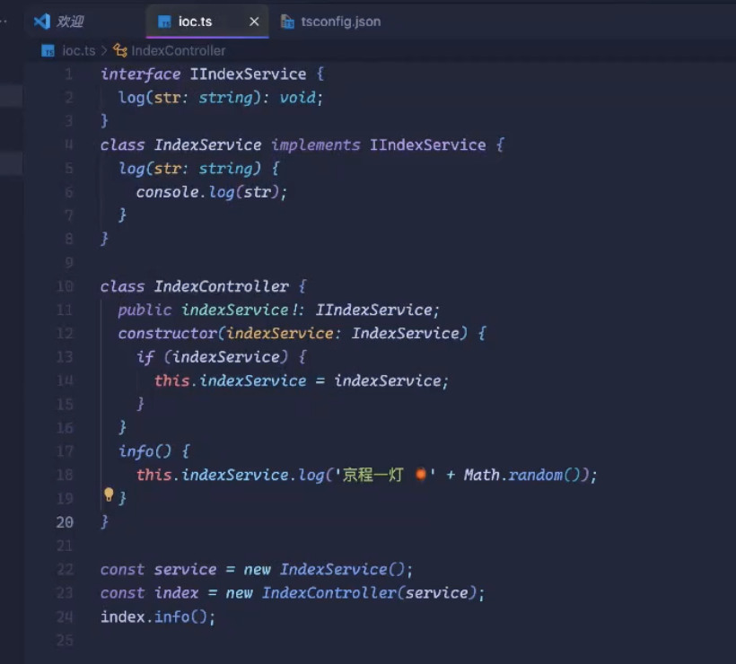

# 前端架构设计指南12

## IOC设计原理
```
mkdir yd-ioc
cd yd-ioc
npm init -y
```
```
新建ioc.ts
tsconfig.json

yarn add ts-node typescript
npx ts-node ioc.ts
```

ioc.ts

```
class CreateIoc {
  public container: Map<symbol, { callback: Function }>;
  constructor() {
    this.container = new Map();
  }

  get(namespace: symbol) {
    const item = this.container.get(namespace);
    if (item) {
      return item.callback();
    } else {
      throw new Error('暂未找到实例');
    }
  }

  bind(key: symbol, callback: Function) {
    this.container.set(key, {
      callback,
    });
  }
}

export default CreateIoc;
```

index.ts
```
import { Parser } from 'acorn';
import { simple } from 'acorn-walk';
import CreateIoc from './ioc';
import 'reflect-metadata';

interface IIndexService {
  log(str: string): void;
}
class IndexService implements IIndexService {
  log(str: string) {
    console.log(str);
  }
}

const TYPES = {
  indexService: Symbol.for('indexService'),
};
const container = new CreateIoc();
container.bind(TYPES.indexService, () => new IndexService());

function extractConstructorParams(classCode: Function) {
  const ast = Parser.parse(classCode.toString(), {
    ecmaVersion: 2022, // 使用新版本以支持类字段语法
    sourceType: 'module',
  });
  const constructorParams: string[] = [];

  simple(ast, {
    MethodDefinition(node) {
      console.log('node: ', node);
      if (node.kind === 'constructor') {
        node.value.params.forEach((param) => {
          if (param.type === 'Identifier') {
            constructorParams.push(param.name);
          } else if (
            param.type === 'AssignmentPattern' &&
            param.left.type === 'Identifier'
          ) {
            constructorParams.push(param.left.name);
          }
        });
      }
    },
  });
  return constructorParams;
}

function haskey<O extends Object>(obj: O, key: PropertyKey): key is keyof O {
  return obj.hasOwnProperty(key);
}
function inject(serviceIdentifier: symbol) {
  return (target: Object, targetKey: string | undefined, index: number) => {
    // console.log('��� ', serviceIdentifier, target, targetKey, index);
    if (!targetKey) {
      Reflect.defineMetadata(
        serviceIdentifier,
        container.get(serviceIdentifier),
        target
      );
    }
  };
}
function controller<T extends { new (...args: any[]): {} }>(constructor: T) {
  return class extends constructor {
    constructor(...args: any[]) {
      //   console.log('🐻 ', constructor);
      const _parmas = extractConstructorParams(constructor);
      console.log('_parmas: ', _parmas);
      super(...args);
      let identity: string;
      for (identity of _parmas) {
        if (haskey(this, identity)) {
          // this[identity] = container.get(TYPES[identity as keyof typeof TYPES]);
          //通过反射的形式这样去设定这个目标的代码
          this[identity] = Reflect.getMetadata(
            TYPES[identity as keyof typeof TYPES],
            constructor
          );
        }
      }
      //@ts-ignore
      //   this.indexService = new IndexService();
    }
  };
}

@controller
class IndexController {
  public indexService!: IIndexService;
  constructor(@inject(TYPES.indexService) indexService?: IndexService) {
    if (indexService) {
      this.indexService = indexService;
    }
  }
  info() {
    this.indexService.log('京程一灯 🏮' + Math.random());
  }
}

// const service = new IndexService();
// const index = new IndexController(service);
// index.info();

//IOC的问题

const index = new IndexController();
index.info();
```

tsconfig.json
```
{
  "compilerOptions": {
    "target": "ESNext",
    "lib": ["ESNext", "dom"],
    "isolatedModules": true,
    "noImplicitThis": true,
    "strictNullChecks": true,
    "moduleResolution": "Node",
    "noImplicitAny": true,
    "emitDecoratorMetadata": true,
    "experimentalDecorators": true
  },
  "exclude": ["node_modules"]
}

```

作业：使用nest.js 链接上一回的博客的数据库使用SAM部署注意配置同一VPC在nest.js中获取你github下的仓库名由哪些（注意子网的路由表）链接上域名
