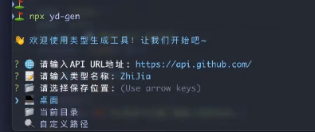

# 前端架构设计指南14
## 前端工程化
工程化=>建私仓

性能优化=>Lighthouse

```
搭建私仓，下载工具vardeccio「轻量级的nodejs的私有的代理」
npm install --global verdaccio
pm2 start / verdaccio
pm2 logs
```

私仓 -> CLI 重复性问题
1. 怎么花里胡哨怎么来
2. 命令行里的选择框
3. 接受命令参数

yd -c 输入内容 -o 指定地址

yd -c abcd -o~/Desktop/a.txt 「把内容abc放入a.txt内」

YD-AI-DAPP
新建.npmrc 可以在npm上发包

发包 npm login 指定下面链接

npm publish 就发上去了
写一下对应的地址
```
//localhost:4873/:_authToken=ZmQ3YjVlNTRlNzMDRlMTk5YTBiOGRlNzQ2OGQ4OWY6YjI2N2Q3NzU5NWViZjQwNGZiMzZhNDZjYjRkY2EyOGUxOQ==registry=http://localhost:4873
```

```
quicktype 生成接口的类型，可以用quciktype写个cli

新建YD-CLI

npm link 去注册 yd-gen 命令

npx yd-gen 执行

npx yd-gen --version 生成文图样式

做了一个命令行 输入一个url 返回一个json， 生成一个在桌面 User.ts的 ts类型文件
npx yd-gen -u https://jsonplaceholder.typeicode.com/users/1 -n User -p ~/Desktop
```

package.json
```
{
  "name": "@yideng/yd-cli",
  "version": "1.2.0",
  "description": "公司内部的Quicktype CLI工具，用于生成类型定义",
  "bin": {
    "yd-gen": "./bin/cli.js"
  },
  "keywords": [
    "quicktype",
    "cli",
    "typescript",
    "types"
  ],
  "author": "495725428@qq.com",
  "license": "ISC",
  "dependencies": {
    "@darkobits/lolcatjs": "^3.1.3",
    "chalk": "^4.1.0",
    "commander": "^11.0.0",
    "figlet": "^1.8.0",
    "inquirer": "^8.2.6",
    "ora": "^4.0.4",
    "quicktype-core": "^23.0.78",
    "shelljs": "^0.8.5"
  }
}

```
