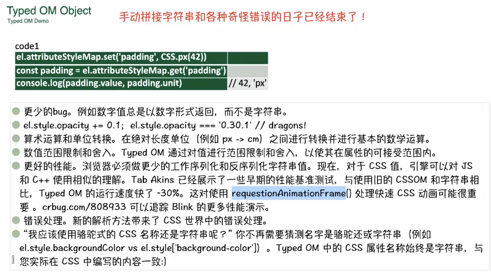

# 前端架构设计指南15
## CSS专题

```
<!DOCTYPE html>
<html lang="en">
<head>
    <meta charset="UTF-8">
    <meta name="viewport" content="width=device-width, initial-scale=1.0">
    <title>Document</title>
    <!DOCTYPE html>
<html lang="en">
<head>
    <meta charset="UTF-8">
    <meta name="viewport" content="width=device-width, initial-scale=1.0">
    <title>Document</title>
    <style>
      //CSSNEXT
      :root {
        --primary-color: #3498db;
        --secondary-color: #2ecc71;
        --text-color: #333;
        --background-color: #f4f4f4;
      }
      body {
        font-family: Arial, sans-serif;
        background-color: var(--background-color);
        color: var(--text-color);
        margin: 0;
        padding: 20px;
        //JSinCSS:js在css执行
        --yideng: () => {
          console.log("111");
        }
      }
    </style>
</head>
<body>
	<div id="app"></div>
</body>
</html>
</head>
<body>
	<div id="app"></div>
</body>
</html>
```

POSTCSS
安装 postcss-preset-env 就可以写上面形式的代码了

### CSS Houdini
1、Properties/Values
```
CSS.regitterProperty({
  name: '--stop-color',
  syntax: '<color>',
  inherits: false,
  initialValue: 'rgba(0,0,0,0)'
})

CSS.unregisterProperty(
  '--stop-color'
)
```

2、Type OM Object
解决目前模型的有一些问题，并实现 CSS Parsing API 和 CSS 属性与值API相关的特性

```
let pos = new CSSPositionValue(
  new CSSUnitValue(5, "px"),
  new CSSUnitValue(10, "px"),
)

el.style.width
el.attributeStyleMap.get('width')

getComputedStyle(el).width
el.computedStyleMap().get('width')
```


3、新的盒模型

# 前端架构设计指南16
## 查缺补漏

1、起笔配置postcss-loader cssnext
2、主人口文件中 import './style.css'
3、@import 'tailwindcss'
4、参考手册 + Figma设计稿
5、免费的MCP
6、tailwind.config.js 公用的 动画+style.css

## 不要用table，要用DataGrid

## MONOREPO
```
pnpm
lerna

作业：完成monorepo，项目相互有依赖的放进去，解决的是项目依赖的问题
```