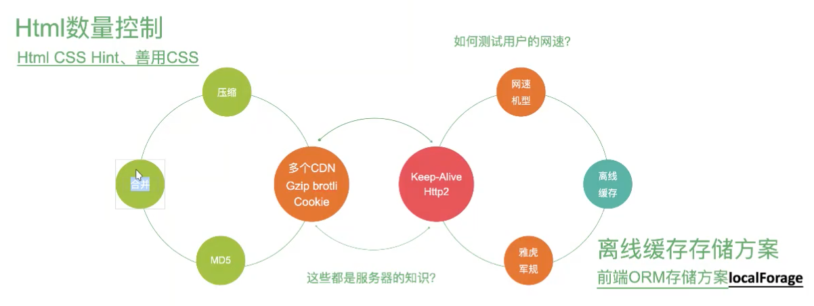
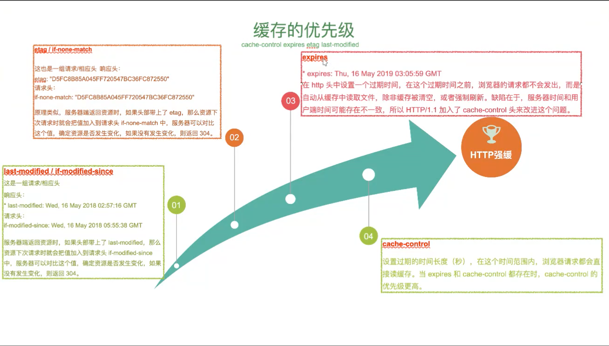
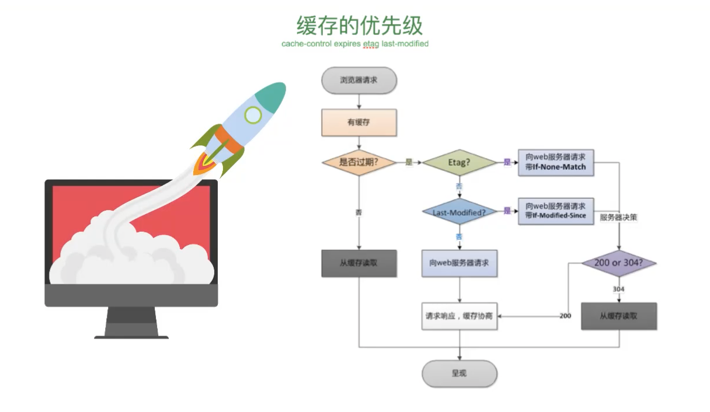
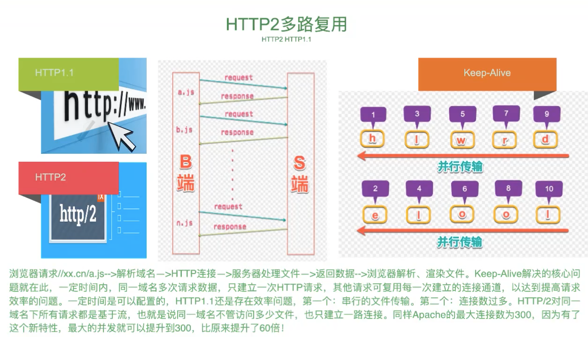
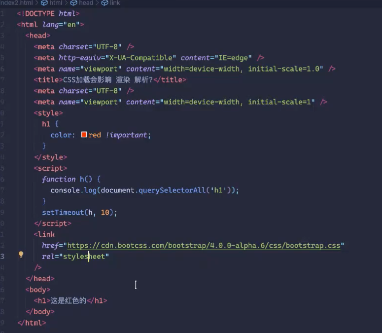
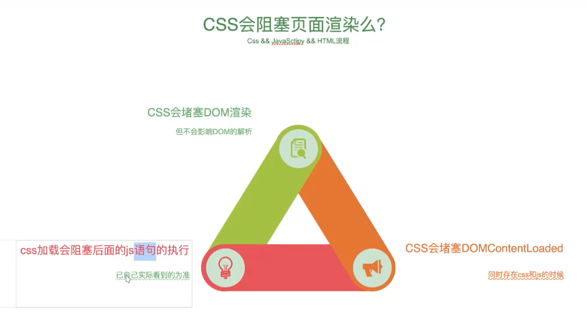
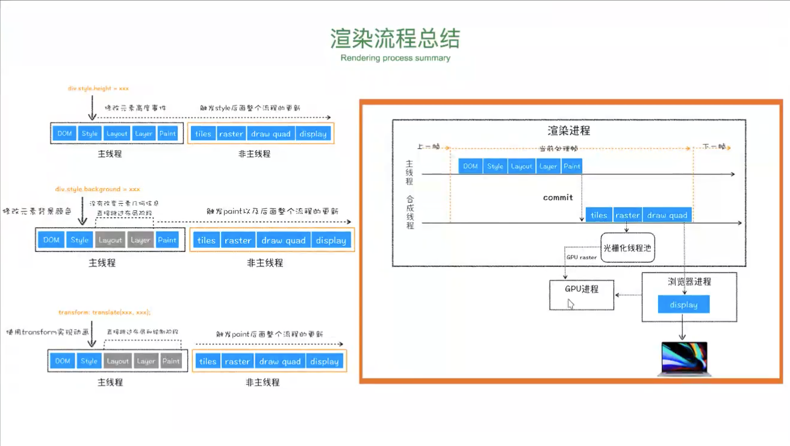

# 前端架构设计指南21
## 性能优化启示录 H5版
### 性能白皮书
**为什么要进行性能优化？**
+ 57% 的用户更在乎网页在3秒内是否完成加载
+ 52% 的在线用户认为网页打开速度影响 到他们对网站的忠诚度
+ 每慢1秒造成页面PV降低11%，用户满意度也随之降低16%
+ 近半数移动用户因为在10秒内仍未打开页面从而放弃

**目录**
1. 性能优化学徒工
  + 雅虎军规
  + 网站协议
  + 缓存策略
  + 小字为先

**雅虎军规践行**

+ HTTP1.1 一个CDN5个请求「标准的请求模式，多了就得等，并发不能多于5个」每个JS的请求Gzip不能大于120kb
+ htmlLint控制dom数量
+ 常见面试题：script 标签中defer和async的区别？
  
  defer 属性告诉浏览器不要等待脚本，浏览器会继续处理 HTML，构建DOM。该脚本“在后台“加载，然后在 DOM完全构建完后再运行。另外defer脚本总是在DOM 准备好时执行（但在 DOMContentLoaded 事件之前）

  async属性意味着该脚本是完全独立的：
  + 浏览器不会阻止async脚本
  + 其他脚本也不会等待async脚本，async脚本也不会等待其他脚本
  + DOMContentLoaded 和 async 脚本不会互相等待
    1. DOMContentLoaded 可能在async脚本执行之前触发「如果async脚本在页面解析完成后完成加载」或在async脚本执行后触发「如果async脚本很快加载完成或在HTTP缓存中」
  简单来说就是 async 脚本在后台加载完就立即执行
+ SPA
index.html => 核心框架之后 => main.js「也就是 index.tsx 拆出来，如下」
路由文件 => 组件「一定不要把组件都搞成同步，同步的话main.js搞成几MB，异步后性能有很大提高」

**缓存的优先级**
cache-control、expires、etag、last-modified

+ 面试题：http缓存和本地缓存有什么区别？
+ http1.1、http2、http3的区别是什么？「必问」

http2解决了http1.1的http层的队头阻塞，http3解决了http2的TCP层的队头阻塞
2. 渲染中性能优化
  + 重绘影响：改颜色
  + 重排影响：改布局，重排必定重绘，重绘未必重排
  + 如何规避
  + 高效渲染
js执行会阻塞html的渲染，必须js完成才展示html；
css的加载会不会阻塞js的执行和解析「执行就是html能不能看见，解析写个setTimeout，css没回来，可不可以解析js」
现代化css的加载会阻塞js执行，但不会阻塞解析，「因为不是ie6那个时候，先返回html，css展示出来和js并行」
把css放到head

分层的元素会脱离文档流「独立成层就脱离文档流，分层后GPU会参与加速」

渲染流程总结

首页一个网页包含主线程，主线程在渲染DOM，解析CSS，然后重排重绘，进行一个分层，分层之后，在进行重绘重排过程中，分层元素进行了GPU合成进程，他会commit，commit之后会把cpu会变成GPU的tiles，tiles会通过raster进行光栅化，光栅化之后，GPU通过raster，在通过发送draw quad命令，在返回浏览器进行dispaly

3. 页面加载性能优化
4. NodeJS性能优化
  + 内存回收
  + 压力测试
  + 内存快照
  + 监控异常
## websdk设计
