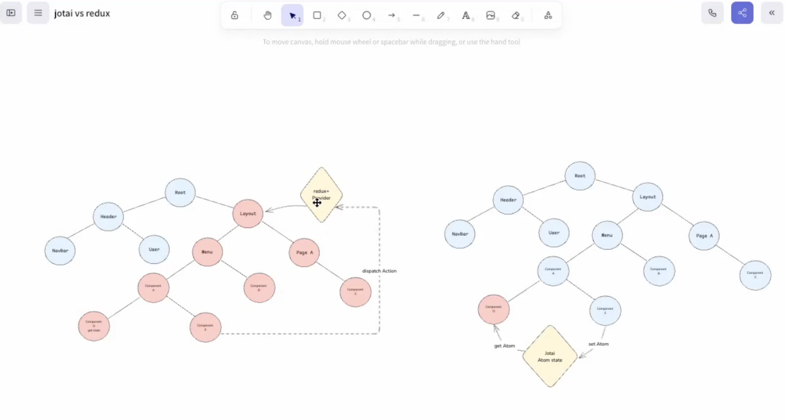
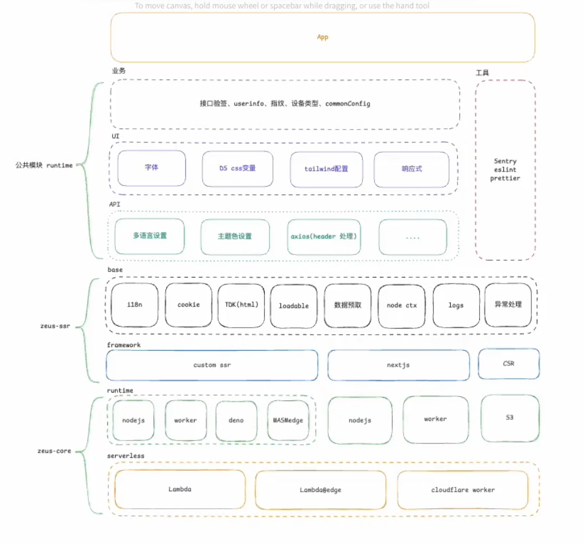
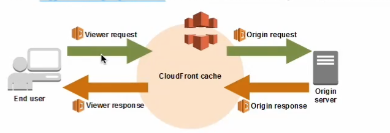
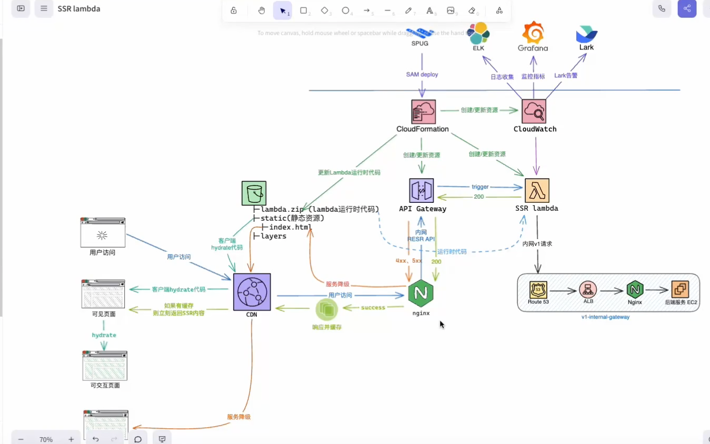
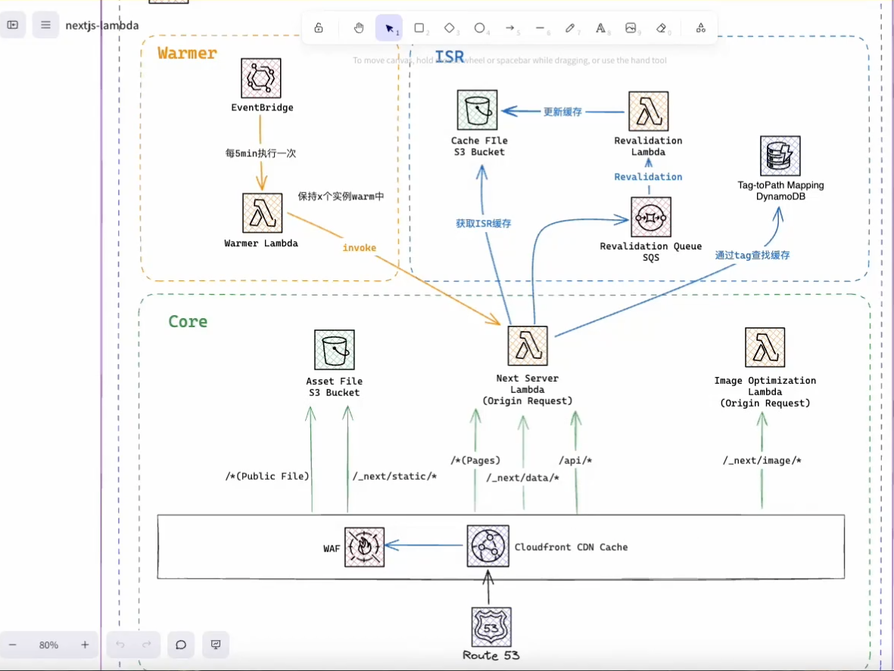
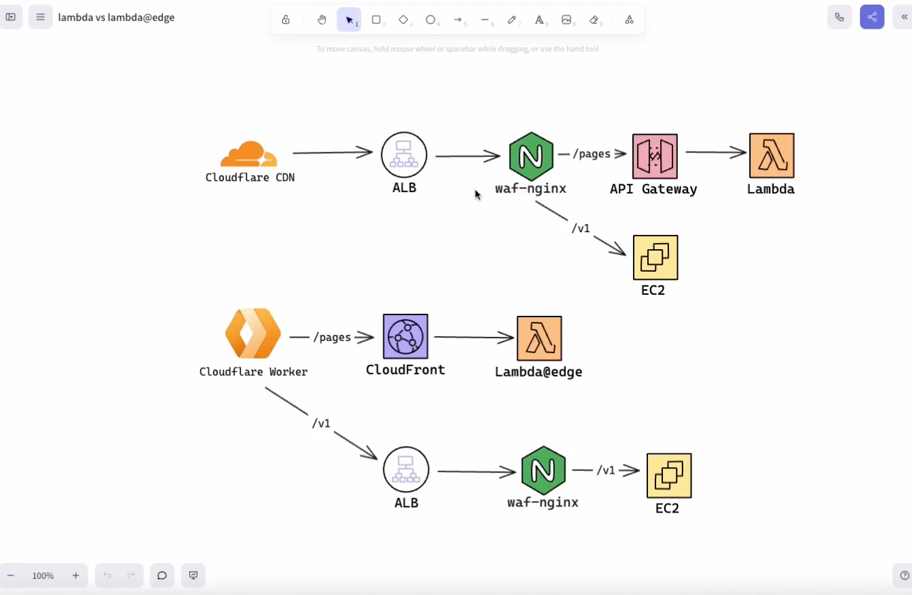
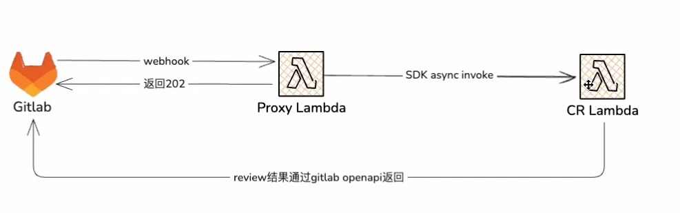
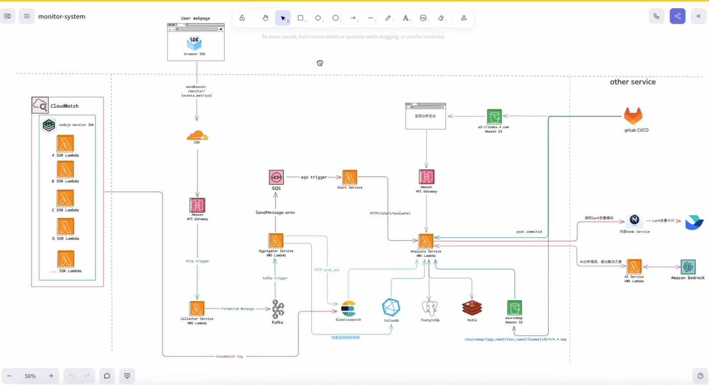
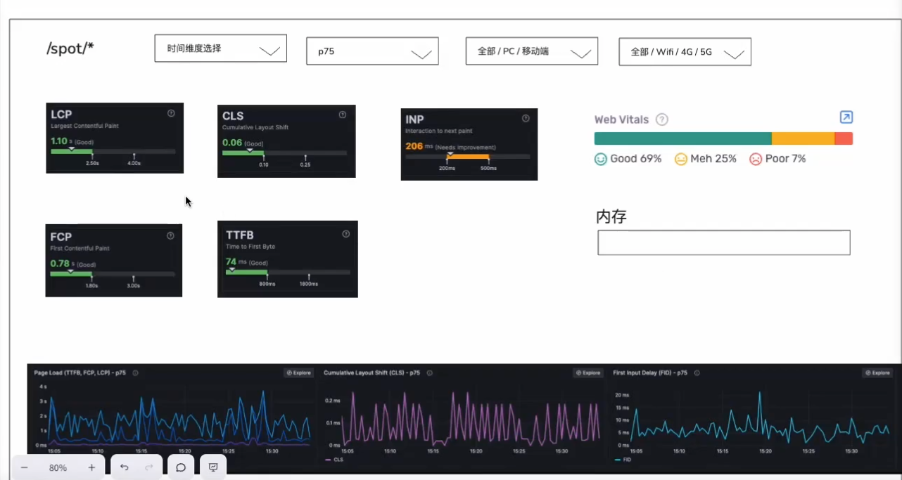
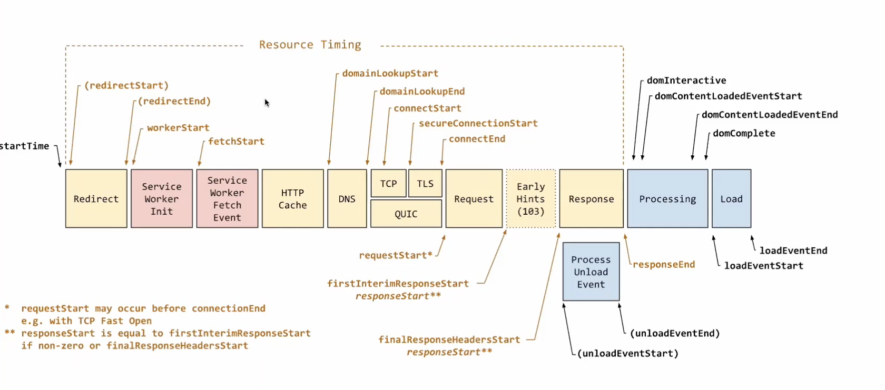

# 前端架构设计指南22
# 前端架构设计指南8「13」

## SSR ( server-side rendering ) 同构
为了解决2个问题
- SEO (国内 SEM 竞价模型：如百度)
- Performance（LCP、 INP、 CLS）

## SSR框架
   - Next.js
   - 自定义SSR框架（币安、okx、bybit、bitget、shopee、今日头条、淘宝）
### ssr的核心
1. 路由定义
2. 数据获取「数据预取」

### Nextjs
### 自定义SSR
#### 应用场景
 nextjs能满足就用nextjs
- nextjs逐渐封闭，很多高级的特性只能在vercel基础上：
   - edge：vercl
   - ISR：vercel， opennext
   - 安全性：https://github.com/vercel/next.js/security/advisories/GHSA-gp8f-8m3g-qnj9
- 极致的性能：100-150ms => 自定义SSR ，40 - 60ms
- 复杂的场景
 - 老项目 CSR 迁移 SSR
 - 微前端
   - module federation
   - 分布式并发渲染: taobao, shopee, baidu
- SRI
- 冷启动： serverless，nextjs13后 4-5s ，自定义SSR 800ms
- 高可用
 - 高并发：10W qps，nextjs扩容不起来 慢
 - 服务降级：SSR崩了(window document) => CSR
 - 容错: try catch, promiserejection
 - 熔断: 异常时候缩小影响范围：opossum

#### 自定义SSR原理
自定义SSR架构设计图

1. 项目构建
   1. 客户端构建 webpack
   2. 服务端构建 webpack
2. http服务
   1. koa
      1. 开发环境：nodemon
      2. 生产部署：serverless：
         - aws lambda
         - cloudflare workers
3. 应用渲染
   - 路由定义
   - 数据获取
   - nodejs koa middleware
     - 日志收集/打印
     - 301 302 重定向
     - 错误处理
   

作业：
1. nextjs 做一个 博客的两个页面，一个是文章列表页，一个是文章详情页，msw
2. 看一下 自定义ssr webpack部分代码
# 前端架构设计指南17「13」
## ServerLess补充
### 特性
1. 自动扩缩容
2. 0运维（监控、日志）
3. 按量计费（计算时长 * 内存占用 * 调用次数），节约95%成本
4. 快速迭代 & 生态健全（CI/CD 灰度 ab test， 版本控制，回滚）项目上线周期从3天+ 缩短到 5分钟
  + 数据库支持（MySQL、Redis、MongoDB、PostgreSQL 等）
  + serverless sqs
  + serverless kafka
5. lambda 是 事件驱动（支持多种触发方式、HTTP、定时、消息队列等、s3）

## 方案目的
使前端nodejs应用 绝对稳定，并且高性能 省时 省力 省钱

## serverless的支持性
1. 计算型 AWS Lambda：nodejs python rust go java，自定义容器（deno）
2. sqs、sns
3. API Gateway: api gateway => lambda
4. DynamoDB
5. S3
6. Kafka

## serverless云厂商
1. aws
2. cloudflare workers
3. azure
4. google cloud
5. 阿里云函数

## 方案目的
部署nodejs应用：nest koa自定义SSR
使前端nodejs应用 绝对稳定，并且高性能 省时 省力 省钱

## 部署一个aws lambda需要哪些生态
1. AWS Lambda: 计算服务
2. API Gateway: API 网关（内网 公网 边缘）
3. S3: 存储服务
4. cloudwatch: 日志监控
5. cloudfront: CDN: lambda@edge 全球13个节点

## 如何发布一个aws serverless
1. SAM：serverless application model
  - 通过 SAM CLI 工具来创建、构建、测试和部署 serverless 应用
  - 使用 AWS CloudFormation 来定义应用的资源
  1. sam init
  2. sam build
  3. sam deploy --guided
2. CDK: Cloud Development Kit
  - 使用编程语言（如 TypeScript、Python、Java等）来定义 AWS 资源
  - 通过 CDK CLI 工具来部署应用
  1. cdk init app --language=typescript
  2. cdk deploy
3. SST:sst v2 CDK: v3基于terraform
4. terraform, terraform cdk

## 如何学习
1. https://medium.com/
2. youtube
3. egghead
4. https://www.udemy.com/
5. 技术周报
  1. https://frontendfoc.us/
  2. node weekly
  3. javascript weekly
6. aws blog：资本层面 投资
7. netflix tech blog
8. cloudflare blog
9. uber blog x86架构迁移arm架构 节约30%资费
10. engineering at meta
11. google io

AI：
claude code
cline、continue

微前端：
支持ssr：module federation、single-spa
MF：lambda http请求s3中的子应用资源

## Lambda「云服务」
计算型serverless
1. 事件驱动 Event trigger
  - HTTP 请求（API Gateway）：SSR、BFF（result API， GraphQL）
  - 定时任务（Eventbridge）最小 1 minute
  - 消息队列（SQS、SNS）
  - 文件上传（S3）：图片优化 png => webp
  - Kafka：MSK、self kafka
  - cloudfront：lambda@edge：边缘计算，边缘部署，全球13个节点（异地容灾）
  - cloudwatch：日志 cloudwatch => lambda(清洗、脱敏、打标) => es => kibana

2. lambda限制
  - 计算时长：最长15分钟：step function 可以串联多个 kambda
  - 内存：128MB - 10GB
  - 并发数：1000个并发，超过需要申请 可以几十万 
  - 包大小：50MB（zip）/250MB（unzip）nodejs node_modules过webpack变异
    - 也可以用layers解决：nodejs 需要执行一个三方的包，打包成一个zip包，上传到lambda layers
  - 环境变量：最多4KB

  Layers
  - 共享代码和依赖：将常用的代码和依赖打包成一个层（Layer），然后在多个 Lambda 函数中复用
  
  step function
  FSM
  - 工作流编排：将多个 Lambda 函数串联起来，形成一个完整的工作流：审批流程
  - 微服务

## 架构设计图
  lambda@edge
  
  SSR lambda
  
  next lambda
  
  lambda vs lambda@edge1
  
  AI code review
  
  monitor-system「监控系统*」
  

  # 前端架构设计指南22

  压测：
  https://www.artillery.io/docs/load-testing-at-scale/aws-lambda

  写代码 => 部署 => 架构设计 => 立项推进 => 团队协作开发 => 技术推广使用

  监控系统
  - 错误监控
    - 日志收集
    - node + browser
  - 性能监控
    - https://github.com/GoogleChrome/web-vitals「要监控5个指标：CLS、INP、LCP、FCP、TTFB」
    - https://web.dev/performance?hl=zh-cn「每天都看」
    - Performance Navigation Timing

  
  

  SST部署：
  1. 初始化sst：`npx sst init`
  2. 配置aws cli
    1. 下载 https://docs.aws.amazon.com/cli/latest/userguide/getting-started-install.html
    2. 配置aws cli:`aws configure`
      - 输入你的 AWS Access Key ID
      - 输入你的 AWS Secret Access Key
      - 输入默认区域名称（例如：`us-west-2`）
      - 输入默认输出格式（例如：`json`）
  3. 部署sst：`npx sst deploy --stage test/production`