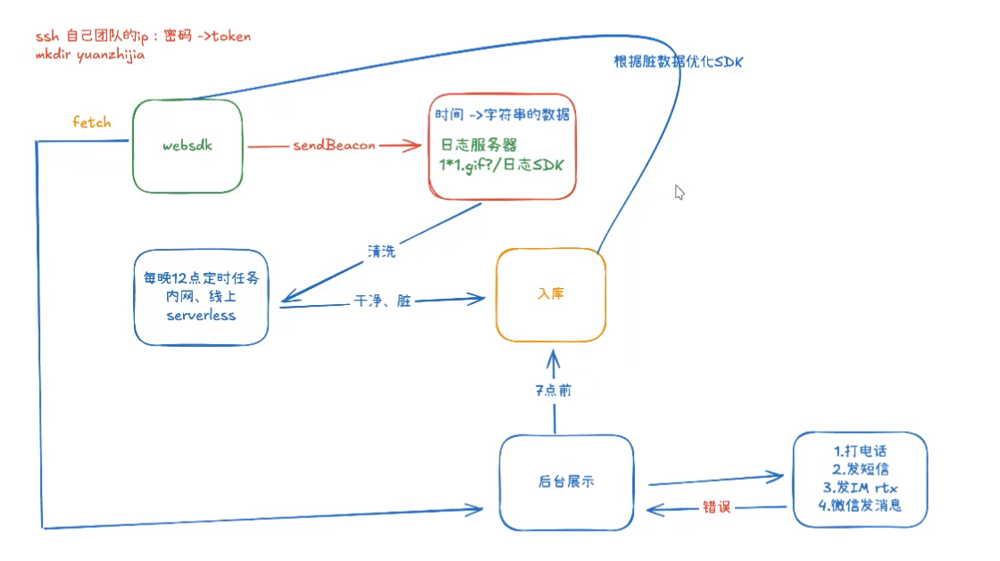
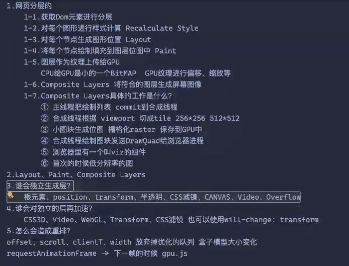
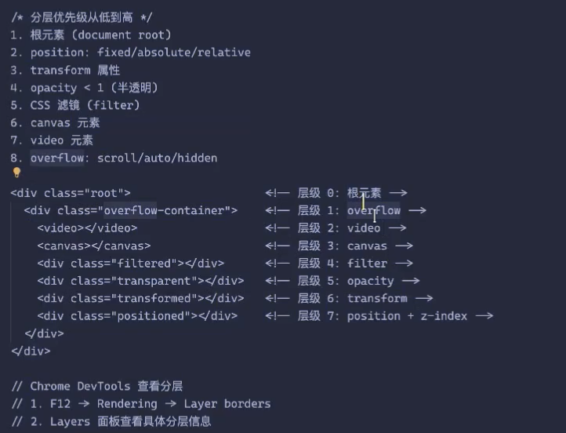
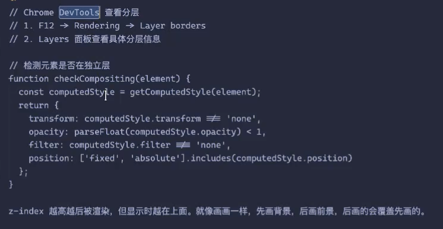
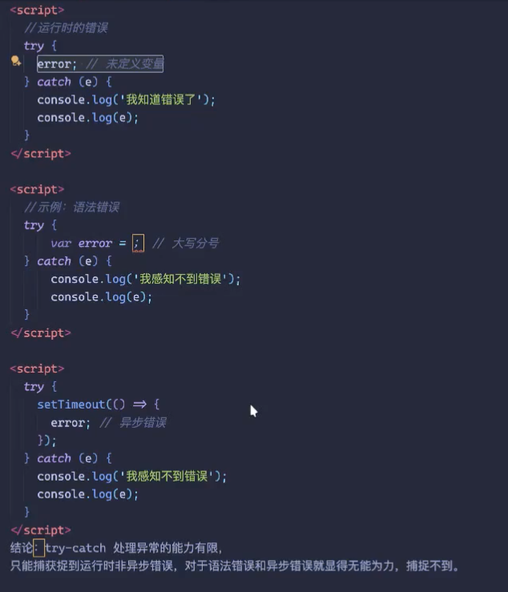

# 前端架构设计指南23
没资源的情况下，最小代价的监控系统






解决性能优化常见的四个杀手锏：GPU.JS、Party Town、react useTranslate、assemblyscript「会把ts的代码编译成bin」

```
问：console.log('2');会打印么？
答：会，每个script是一个独立的块，不会互相影响
<script>
  error;
  console.log('1');
</script>
<script>
  console.log('2');
</script>
```
