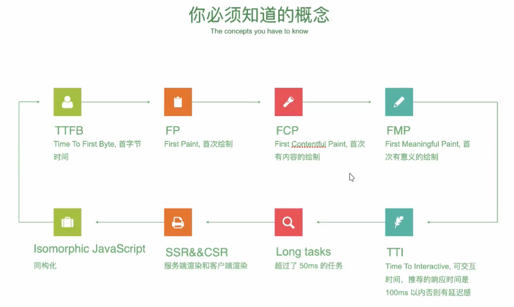
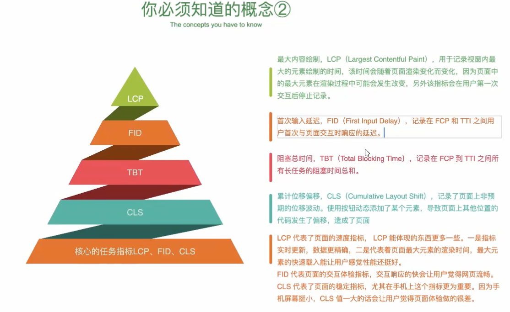
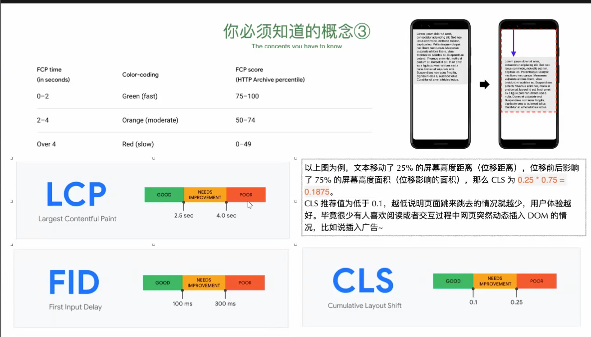

# 前端架构设计指南-终
## 页面加载性能优化
+ CSR
+ SSR
+ FMP
+ TTI



web.dev

demo/demo1.html
```
<!DOCTYPE html>
<html lang="en">
<head>
  <meta charset="UTF-8">
  <meta name="viewport" content="width=device-width, initial-scale=1.0">
  <title>监听用户数据指标</title>
  <style>
    body {
      // 必须启动serve才能监控
      // FP:首个像素落点，没有像素的话，就监控不到
      background: yellowgreen;
    }
  </style>
</head>
<body>
  <div id="app"></div>
  <script src="./fp.js"></script>
</body>
</html>
```

demo/fp.js
```
const observer = new PerformanceObserver((list) => {
  console.log(entry);
});

observer.observe({
  //longtask
  entryTypes: ['paint'],
});
```