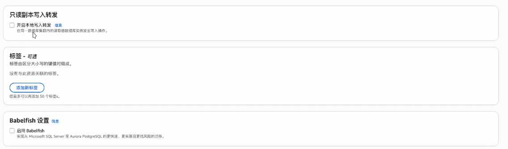

# 如何正确使用数据库
多点复用、异地多活，设计集群的

比如这个服务器挂了，就会切换到最近的服务器，都挂了，就会在去寻找整个机房

数据库是非常昂贵的，如果没有创建好对应的数据库，那么就会一个月就会产生5000刀-50刀的差价，那么怎么数据库的低成本，又能做到数据库的异地多活呢？

做数据库的集群「面试直接说你会」我们就整PostgreSQL 和 mongodb，mysql和oracle太难了

aws亚马逊创建数据库集群

点开Aurora and RDS

只需要选择数据库，设置用户名，密码，还有选择Severless，设置容量0，其余不需要修改

然后创建就可以得到数据库集群「集群有很多服务器，单点就一个，爆了就爆了」

1、创建数据库Aurora

在 AWS... 中管理的话，更安全，密钥存到了aws中，没有人可以拿得到，先有AWS的私钥，才能拿到aws中数据库的密钥

实例配置选Serverless v2、容量最小设为0，可以使你的费用骤降了几十倍，没人用相当于关机

immutable 不可变对象「面试」为了减少无意义的渲染
对象除非重写才变，改里面的内容，引用地址不会变化

不可变首先创建快对象，把变化的拿出来，然后把原来不变的数据拿过来，原来的对象不用了，好处是修改变化的部分，

好处：
/**
 * 1.方便做diff，避免无意义的渲染
 * 2.只拷贝变动的节点，其余部分保持引用不变（结构共享）
 * 3.不会意外地“改坏”原始数据
 * 4.创建新结构 属于V8底层的快对象 性能更好
 */