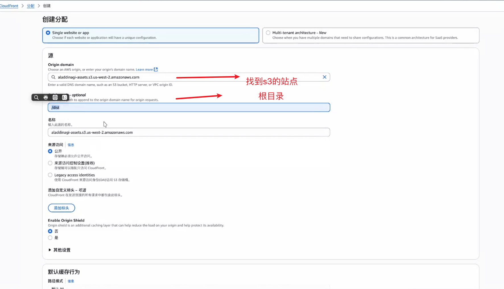

# 前端架构设计指南7
dist 直接部署到服务器，就会出现404情况，因为这是一个假路由，需要做适配
用ngnix配置方向代理，代理到首页；现在很少人用ngnix了，配置太繁琐，现在都是把dist文件夹下的内容，直接丢到网盘「阿里云oss、aws S3」

aws S3
+ 创建存储桶 把 阻止所有公开访问 打开，然后上传文件就可以了
+ 然后想要支持pushState的话，打开 属性下面的 静态网站托管 启用就可以上线了
+ 启动静态管理后，可以配置一下错误索引404页面和其他一些页面
+ 可以配置CloudFront - 创建分配「找到s3站点、和根目录，直接创建」


index-prod.html
react要找cdn不要让react参与构建「可以先用个免费的，公司项目要用自己公司内部的」
```
<!DOCTYPE html>
<html lang="en">
<head>
    <meta charset="UTF-8">
    <meta name="viewport" content="width=device-width, initial-scale=1.0">
    <title>Document</title>
    <script crossorigin src="https://unpkg.com/react@18/umd/react.development.js"></script>
    <script crossorigin src="https://unpkg.com/react-dom@18/umd/react-dom.development.js"></script>
</head>
<body>
    
</body>
</html>
```

index-prod.html
```
//开启JS多线程的压缩
const TerserPlugin = require('terser-webpack-plugin');
const CssMinimizerPlugin = require('css-minimizer-webpack-plugin');
const { join, resolve } = require('path');
const HtmlWebpackPlugin = require('html-webpack-plugin');
//整站离线缓存
// const WorkboxPlugin = require('workbox-webpack-plugin');

module.exports = {
  output: {
    path: join(__dirname, '../dist'),
    publicPath: '/',
    filename: 'scripts/[name].[contenthash:5].bundule.js',
    assetModuleFilename: 'images/[name].[contenthash:5][ext]',
  },
  experiments: {
    outputModule: true,
  },
  //性能，超过限制无法打包
  performance: {
    maxAssetSize: 250000, // 最大资源大小250KB
    maxEntrypointSize: 250000,  // 最大入口资源大小250KB
    hints: 'warning', // 超出限制时只给出警告
  },
  //多线程的压缩
  optimization: {
    minimize: true,
    minimizer: [
      new CssMinimizerPlugin({
        parallel: true,
      }),
      new TerserPlugin({
        parallel: true,
      })
    ]
  },
  //排除react包，构建速度会快很多
+ externals: {
+   react: 'React',
+   'react-dom': 'ReactDOM',
+ },
  plugins: [
    // new WorkboxPlugin.GenerateSW({
    //   clientsClaim: true, // Service Worker 激活后立即控制页面
    //   skipWaiting: true, // 跳过等待，直接激活新的 Service Worker
    //   // 预缓存的匹配规则（默认缓存所有 Webpack 输出的文件）
    //   include: [/\.html$/, /\.js$/, /\.css$/],
    //   // 可选：添加运行时缓存策略
    //   runtimeCaching: [
    //     {
    //       urlPattern: /.\(?:png|jpg|jpeg|svg)$/, // 匹配图片资源
    //       handler: 'CacheFirst', // 使用“缓存优先”策略
    //       options: {
    //         cacheName: 'images', // 缓存名称
    //         expiration: {
    //           maxEntries: 10, // 最多缓存 10 个文件
    //           maxAgeSeconds: 30 * 24 * 60 * 60, // 缓存 30 天
    //         },
    //       },
    //     },
    //     {
    //       // API 请求缓存策略
    //       urlPattern: /^https:\/\/api\./,
    //       handler: 'NetworkFirst',
    //       options: {
    //         cacheName: 'api-cache',
    //         networkTimeoutSeconds: 3,
    //         expiration: {
    //           maxEntries: 50,
    //           maxAgeSeconds: 5 * 60, // 5 分钟
    //         },
    //       },
    //     },
    //   ]
    // }),
    new HtmlWebpackPlugin({
      title: 'Yideng',
      filename: 'index.html',
      template: resolve(__dirname, '../src/index-prod.html'),
      favicon: './public/favicon.ico',
    }),
  ],
};
```

3.MPA「Koa、Nest.js」

+ BFF「应用提供定制化的后端服务。它的核心思想是为不同的前端客户端(如 Web、移动端、桌面端等)提供专门的后端服务,而不是让所有客户端共享同一个通用的后端 API。 1. BFF 的核心概念 定制化服务:BFF 为特定的前端客户端提供定制化的 API,满足其独 」

SPA：js => 请求接口 3个接口
BFF：js => node => 请求接口
{
  1个
}
封装接口，减少请求
最重要是让node渲染react，同构

# SPA「是最慢、最差的前端架构，最简单」
SPA渲染页面经过了哪些步骤
index.html
三方仓库
-> main.js -> 路由 -> 组件 -> 发请求 -> 渲染虚拟DOM -> 对比DOM -> 事件合成 -> 展现出来

# 创建目录结构
创建 mkdir YD-AI-BFF

cd YD-AI-BFF

npm init -y

YD-AI-BFF
|- assets
|- config
|- interface
|- logs
|- middlewares
|- routers
|- services
|- typings
|- views
|- .env
|- app.ts
|- package.json
|- tsconfig.json


tsconfig.json
```
{
  "compilerOptions": {
    "target": "ES2024",
    "noImplicitAny": true,
    "noImplicitThis": true,
    "experimentalDecorators": true,
    "esModuleInterop": true,
    "module": "NodeNext",
    "moduleResolution": "nodenext",
    "allowSyntheticDefaultImports": true,
    "typeRoots": ["typings"],
    "baseUrl": "./",
    "paths": {
      "@interfaces/*": ["interface/*"],
      "@config/*": ["config/*"],
      "@middlewares/*": ["middlewares/*"]
    }
  },
  "include": ["**/*"]
}
```

# IOC
IOC
DI
AOP

不需要import A，B，C这样写了


D
class D {
  构造函数({A,B,C}) {
    //依赖注入
    A.需要的方法()；
    this.a = A;
  }

  logs() {
    this.a.需要的方法()
  }
}

yarn add awilix-koa awilix koa koa-router

yarn add @types/node 「找到__dirname」

yarn add @types/koa 「找到koa」

yarn add @types/koa-router 「找到koa-router」

yarn add typescript

yarn add ts-node-dev --dev

yarn dev

yarn add co

yarn add @types/co

package.json
```
  "scripts": {
    "dev": "ts-node-dev --respawn --transpile-only app.ts"
  },
```

yarn add koa-swig 「后端的一个模板」

routers/ApiController.ts
```
import { GET, route } from 'awilix-koa';
import Router from 'koa-router';
import { IApi } from '@interfaces/IApi';

@route('/api')
class ApiController {
  private apiService: IApi;
  constructor({ apiService }: { apiService: IApi }) {
    this.apiService = apiService;
  }
  @route('/list')
  @GET()
  async actionList(
    ctx: Router.IRouterContext,
    next: () => Promise<any>
  ): Promise<any> {
    const data = await this.apiService.getInfo();
    ctx.body = {
      data,
    };
  }
}
export default ApiController;
```

ApiService.ts
```
import { IApi } from '@interfaces/IApi';
import { IData } from '@interfaces/IData';

class ApiService implements IApi {
  getInfo() {
    //区别开 MPA 和 SPA
    // window.localStorage.get('info');
    // if(){}..
    return new Promise<IData>((resolve) => {
      resolve({
        item: '我是后台数据',
        result: [1, 'next'],
      });
    });
  }
}
export default ApiService;
```

app.ts
```
import Koa from 'koa';
import { createContainer, Lifetime } from 'awilix';
import { scopePerRequest } from 'awilix-koa';

const app = new Koa();
const port = 3000;
const container = createContainer();
// 所有的可以被注入的代码都在container中
container.loadModules([`${__dirname}/services/*.ts`], {
  formatName: 'camelCase',
  resolverOptions: {
    lifetime: Lifetime.SCOPED,
  },
});

// 每一次用户请求router中 都会从容器中取到注入的服务
app.use(scopePerRequest(container));
// 让所有的路由全部生效
app.use(loadControllers(`${__dirname}/routers/*.ts`));
app.listen(port, () => {
  console.log('YD Server BFF启动成功');
});
```

interface/IData.ts
```
import { IData } from './IData';

export interface IApi {
  getInfo(): Promise<IData>;
}
```

interface/IApi.ts
```
import { IData } from './IData';

export interface IApi {
  getInfo(): Promise<IData>;
}
```

routers/IndexController.ts
```
import { GET, route } from 'awilix-koa';
import { Context } from '@interfaces/IKoa';

@route('/')
class IndexController {
  @GET()
  async actionList(ctx: Context): Promise<void> {
    const data = await ctx.render('index', {
      data: '服务端数据',
    });
    console.log('🌹🌹🌹🌹🌹🌹🌹🌹', data);

    ctx.body = data;
  }
}
export default IndexController;
```

interface/IKoa.ts
```
// interfaces/IKoa.ts

import * as Koa from 'koa';

// 直接定义 render 方法的类型
type RenderFunction = (
  view: string,
  options?: { [key: string]: any }
) => Promise<string>;

export interface Context extends Koa.Context {
  render: RenderFunction;
}
```

自己用AI写一个@types/koa-swig 的包，因为没有人写

typings/koa-swig.d.ts
```
declare module 'koa-swig' {
  import { Context } from 'koa';

  interface KoaSwigOptions {
    /**
     * Root directory for templates
     */
    root?: string;
    
    /**
     * Template cache options
     */
    cache?: boolean | 'memory';
    
    /**
     * Template file extension
     */
    ext?: string;
    
    /**
     * Whether to auto-escape template variables
     */
    autoescape?: boolean;
    
    /**
     * Custom filters for templates
     */
    filters?: { [key: string]: Function };
    
    /**
     * Custom tags for templates
     */
    tags?: { [key: string]: Function };
    
    /**
     * Template variable start and end delimiters
     */
    varControls?: [string, string];
    
    /**
     * Template tag start and end delimiters
     */
    tagControls?: [string, string];
    
    /**
     * Template comment start and end delimiters
     */
    cmtControls?: [string, string];
    
    /**
     * Local variables available to all templates
     */
    locals?: { [key: string]: any };
    
    /**
     * Custom loader function
     */
    loader?: Function;
    
    /**
     * Whether to write compiled templates to cache
     */
    writeBody?: boolean;
  }

  interface RenderedSwig {
    /**
     * Set local variables
     */
    setLocals(args: { [key: string]: any }): void;

    /**
     * Get local variable by key
     */
    getLocals(key: string): any;
    
    /**
     * Get all local variables
     */
    getLocals(): { [key: string]: any };
    
    /**
     * Set a single local variable
     */
    setLocal(key: string, value: any): void;
    
    /**
     * Set custom filter
     */
    setFilter(name: string, filter: Function): void;
    
    /**
     * Set custom tag
     */
    setTag(name: string, tag: Function): void;
    
    /**
     * Render template with given context
     */
    render(template: string, context?: { [key: string]: any }): string;
    
    /**
     * Render template file with given context
     */
    renderFile(path: string, context?: { [key: string]: any }): string;
    
    /**
     * Compile template string
     */
    compile(template: string, options?: any): Function;
    
    /**
     * Compile template file
     */
    compileFile(path: string, options?: any): Function;
  }

  interface SwigRenderer {
    (view: string, options?: { [key: string]: any }): Promise<string>;
  }

  interface KoaSwigRenderer {
    (settings?: KoaSwigOptions): (
      ctx: Context
    ) => Generator<Promise<string>, void, unknown>;
  }

  interface KoaSwigMiddleware {
    /**
     * Render template
     */
    render(view: string, locals?: { [key: string]: any }): Promise<string>;
    
    /**
     * Set response body with rendered template
     */
    renderView(view: string, locals?: { [key: string]: any }): Promise<void>;
  }

  // Extend Koa Context to include render methods
  module 'koa' {
    interface Context {
      render: KoaSwigMiddleware['render'];
      renderView: KoaSwigMiddleware['renderView'];
    }
  }

  const renderer: KoaSwigRenderer & {
    swig: RenderedSwig;
  };

  export = renderer;
}
```

yarn add lodash

config/index.ts
```
import _ from 'lodash';
import { join } from 'path';

let config = {
  viewDir: join(__dirname, '..', 'views'),
  staticDir: join(__dirname, '..', 'assets'),
  port: 8081,
  memoryFlag: false,
};
if (process.env.NODE_ENV === 'development') {
  let localConfig = {
    port: 8081,
  };
  config = _.assignIn(config, localConfig);
}
if (process.env.NODE_ENV === 'production') {
  let prodConfig = {
    port: 8082,
    memoryFlag: 'memory',
  };
  config = _.assignIn(config, prodConfig);
}

export default config;
```

yarn add module-alias

yarn add @types/module-alias

app.ts
```
+ import { addAliases } from 'module-alias';
+ addAliases({
+  '@root': __dirname,
+  '@interfaces': `${__dirname}/interface`,
+  '@config': `${__dirname}/config`,
+  '@middlewares': `${__dirname}/middlewares`,
+ });
import Koa from 'koa';
import { createContainer, Lifetime } from 'awilix';
import co from 'co';
import render from 'koa-swig';
import config from '@config/index';
import { loadControllers, scopePerRequest } from 'awilix-koa';
+ // koa中没有实现的路由重定向到index.hmlt
+ import { historyApiFallback } from 'koa2-connect-history-api-fallback';

const app = new Koa();
+ const { port, viewDir, memoryFlag, staticDir } = config;
const container = createContainer();
// 所有的可以被注入的代码都在container中
container.loadModules([`${__dirname}/services/*.ts`], {
  formatName: 'camelCase',
  resolverOptions: {
    lifetime: Lifetime.SCOPED,
  },
});

// 每一次用户请求router中 都会从容器中取到注入的服务
app.use(scopePerRequest(container));
app.context.render = co.wrap(
  render({
    root: viewDir,
    autoescape: true,
    cache: <'memory' | false>memoryFlag,
    writeBody: false,
    ext: 'html',
  })
);
+ app.use(historyApiFallback({ index: '', whiteList: ['/api'] }));
// 让所有的路由全部生效
app.use(loadControllers(`${__dirname}/routers/*.ts`));
app.listen(port, () => {
  console.log('YD Server BFF启动成功');
});
```

1. 接下来把 YD-AI-DAPP 项目下的dist/下的文件夹 copy 到 views/
2. 把scripts和styles 放到 assets/文件夹下
3. app.ts 中指定一下静态资源文件

yarn dev 就可以启动一个SPA + MPA 的项目了，到时刷新出现404

所以安重定向的包，把除了api的路由，都重定向到首页

yarn add koa2-connect-history-api-fallback

yarn add koa-static

yarn add @types/koa-static

app.ts
```
import { addAliases } from 'module-alias';
addAliases({
  '@root': __dirname,
  '@interfaces': `${__dirname}/interface`,
  '@config': `${__dirname}/config`,
  '@middlewares': `${__dirname}/middlewares`,
});
import Koa from 'koa';
import { createContainer, Lifetime } from 'awilix';
import co from 'co';
import render from 'koa-swig';
import config from '@config/index';
+ import serve from 'koa-static';
import { loadControllers, scopePerRequest } from 'awilix-koa';

const app = new Koa();
const { port, viewDir, memoryFlag, staticDir } = config;
+ // 静态资源生效节点
+ app.use(serve(staticDir));

const container = createContainer();
// 所有的可以被注入的代码都在container中
container.loadModules([`${__dirname}/services/*.ts`], {
  formatName: 'camelCase',
  resolverOptions: {
    lifetime: Lifetime.SCOPED,
  },
});

// 每一次用户请求router中 都会从容器中取到注入的服务
app.use(scopePerRequest(container));
app.context.render = co.wrap(
  render({
    root: viewDir,
    autoescape: true,
    cache: <'memory' | false>memoryFlag,
    writeBody: false,
    ext: 'html',
  })
);

app.use(historyApiFallback({ index: '/', whiteList: ['/api'] }));
// 让所有的路由全部生效
app.use(loadControllers(`${__dirname}/routers/*.ts`));
app.listen(port, () => {
  console.log('YD Server BFF启动成功');
});
```

由前端服务改为后端服务，pm2管理

pm2配置

npm install pm2 -g

pm2 start
ecosystem.config.js
```
// pm2.config.js
module.exports = {
  apps: [
    {
      name: 'yd-app',
      script: './app.ts',
      instances: 1,
      exec_mode: 'cluster',
      interpreter: './node_modules/.bin/ts-node', // 使用本地 ts-node
      autorestart: true,
      watch: true,
      env: {
        NODE_ENV: 'development',
        TS_NODE_PROJECT: './tsconfig.json',
      },
      env_production: {
        NODE_ENV: 'production',
        TS_NODE_PROJECT: './tsconfig.json',
      },
      error_file: './logs/yd-app-error.log',
      out_file: './logs/yd-app-out.log',
      merge_logs: true,
      log_date_format: 'YYYY-MM-DD HH:mm:ss',
    },
  ],
};
```